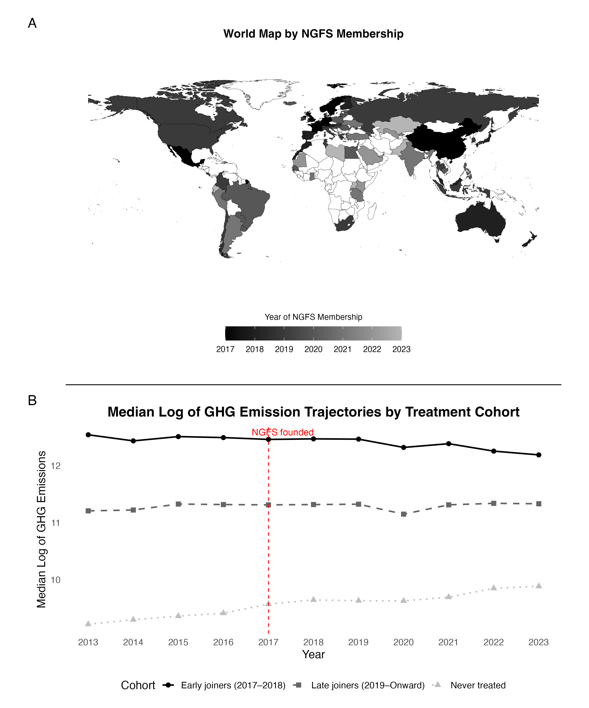
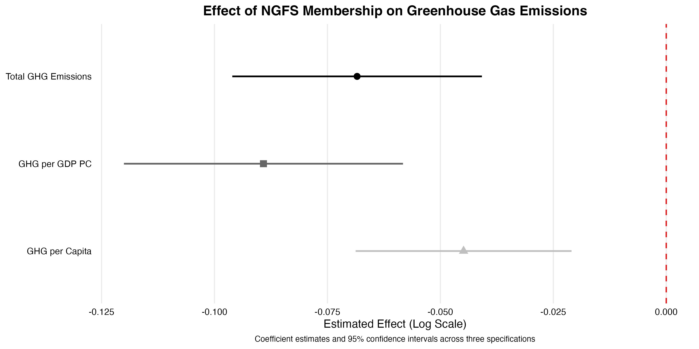
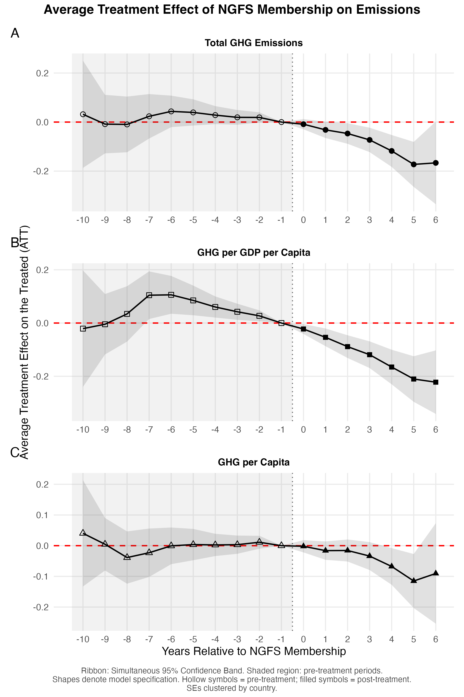
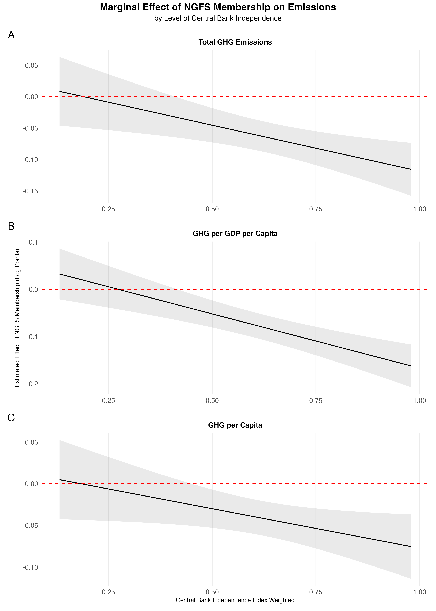
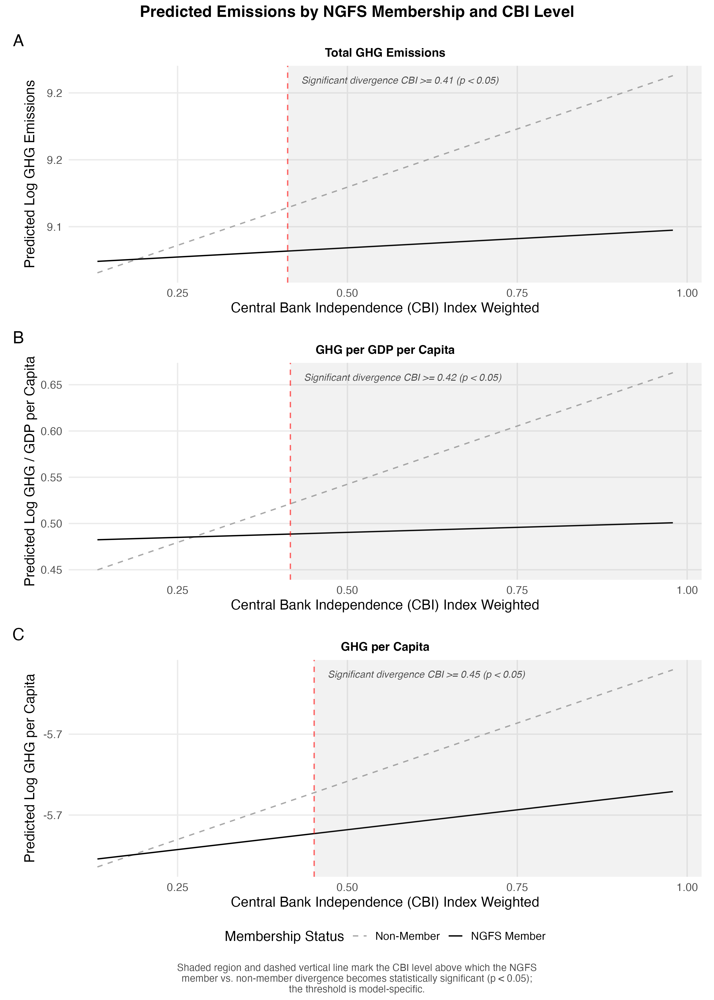



Why do some countries translate international climate commitments into emissions reductions while others do not? One answer relates to the role central banks play in directing investments to low-carbon markets [@battiston2021; @boneva2022; @dombret2021; @keenan2019]. Central banks regulate how trillions of dollars flow from banks and investment funds into the economy, governing which sectors receive capital and according to what rules, statutes, and norms [@amsden2001; @sabel2024; @wade1990; @zysman1983]. Yet, whether and how financial supervisors facilitate or hinder the low-carbon transition remains an ongoing discussion [@battiston2021; @boneva2022; @campiglio2018; @dombret2021; @helleiner2025; @keenan2019]. I illuminate this discussion by estimating the extent to which nations internationally committed to "green" their central banks emit less greenhouse gases (GHG) than nations with conventional central banks.

Addressing the question above by focusing on financial supervisors has pressing policy implications. Confronting the climate crisis requires decarbonizing not only factories, value chains, and power grids but also the financial systems that fund them. A challenge for the empirical analysis of central banks' influence on decarbonizing the global economy is that no consistent cross-national marker has distinguished countries with "green" central banks from nations with conventional ones. This changed in 2017, when the Network of Central Banks and Supervisors for Greening the Financial System (NGFS) was established [@helleiner2025; @ngfs2025]. 

The NGFS offers the first public registry of financial regulators formally and internationally committed to integrating climate risks into macroeconomic supervision [@ngfs2025]. Using NGFS membership as a treatment indicator, I compare GHG emission trajectories across 145 countries from 2013 to 2023 ($N = 1,595$). To account for the fact that countries joined the NGFS in different years---i.e., staggered treatment timing---,I employ the Callaway and Sant'Anna [-@callaway2021] doubly robust estimator, which isolates cohort-specific treatment effects and is robust to the heterogeneous treatment timing that standard two-way fixed effects models fail to handle without bias. Difference-in-differences models with two-way fixed effects reveal that, within countries, joining the NGFS is associated with a subsequent deceleration in emission growth. This reduction ranges from approximately 4% to 9% lower emissions relative to what within-country trends would otherwise predict, after controlling for economic, ecological, and political factors. 

The effect above grows with central bank independence [@garriga2016; @garriga2025]. NGFS membership carries little measurable impact where central banks lack insulation from executive control, but becomes substantial where bureaucratic autonomy [@bersch2023] to act independently from executive overreach is high [@dias2026]. Institutional capacity to implement policies [@mcdonnell2020] aimed at managing environmental externalities independently from partisan pressures helps reduce emissions. Central bank independence and its limits are often defined by statutes [@dincer2024]. This process entails deliberations between members of the executive and legislative powers [@fernandez-albertos2015], which can ultimately end in court [@hayo2008], making it challenging for political leaders to undermine such regulatory powers [@dias2026].^[But see Fernandéz-Albertos -@fernandez-albertos2015 for a discussion of the potential politicization of central banks.] These findings suggest that participation in international regulatory networks, conditioned by domestic institutional capacity and bureaucratic autonomy, shapes how financial regulation can contribute to decarbonization.

<!-- 

^[Governance is a process through which policies are formed and reformed [@mcginnis2011]. Regulation consists of rules, norms, and practices through which state authorities shape the allocation of credit and capital across the economy [@zysman1983].] Whether and how financial supervisors facilitate or hinder the low-carbon transition is, therefore, a condition for decarbonizing the global economy. 

^[I draw from @garriga2025 [850] and define central bank independence as a multidimensional feature: "Personnel independence reflects limits to the government's influence on the central bank board's membership or tenure. Financial independence restricts the government's ability to use the central bank's loans to fund its expenditures, to avoid monetary policy subordination to fiscal policy. Finally, policy independence reflects the central bank's powers to formulate and execute monetary policy. This includes the central bank's ability to set the goals and/or choose the instruments of monetary policy". Autonomy, in parallel, consists of central banks being capable of producing, changing, and implementing policy as independently from executive power as possible [@dias2026].]

-->

## Central Banks, Climate Change, and Economic Policy

Central banks and financial supervisors shape where capital goes. By issuing prudential rules and regulations with which banks and investment funds must comply, central banks govern which sectors of the real economy receive financing [@zysman1983]. This feature has been historically documented when nations prioritized industrial, carbon-intensive development [@amsden2001; @evans1995; @wade1990]. As climate risks have emerged as a recognized systemic financial risk [@battiston2021; @wef2026], central banks have increasingly been called upon to extend its regulatory powers toward decarbonization [@dombret2021; @keenan2019; @meckling2011]. The NGFS---established at the Paris "One Planet Summit" in 2017 and spearheaded by financial supervisors from France, China, England, Germany, Mexico, Norway, Singapore, and Sweden---has worked to build a coordinating infrastructure for climate-aligned financial supervision [@helleiner2025; @ngfs2025].

Financial regulators that join the NGFS commit to integrating climate scenarios into financial supervision and to standardizing the classification of "green" and "brown" assets [@battiston2021; @ngfs2025]. One goal is to facilitate capital reallocation from carbon-intensive (i.e., "brown") to low-carbon (i.e., "green") ventures. Some NGFS members have translated these commitments into binding domestic regulations. For example, in 2021, Brazil's central bank mandated that financial institutions disclose climate liabilities under their Social, Environmental, and Climate Responsibility Policy (PRSAC)^[In Portuguese, PRSAC refers to Política de Responsabilidade Social, Ambiental e Climática.] documents [@dias2026]. The Brazilian central bank relied on its bureaucratic autonomy to implement policies without executive interference [@dias2026]. By contrast, the U.S. Federal Reserve---constrained by political opposition---joined the NGFS only during the Biden administration [@dias2026]. This contrast illustrates that central bank independence [@garriga2025] is not merely a macroeconomic property but a precondition for effective climate governance.

A natural skeptical reaction to such international commitments is that NGFS membership might represent "performative governance" [@ding2020; @hafner-burton2005]. That is, in response to their citizens' pressure, wealthy, industrialized nations that have already been on a decarbonization path may have joined the NGFS because the costs of membership were low and the reputational benefits were high. Based on this argument, any observed emissions gap between NGFS members and non-members would reflect pre-existing trajectories rather than an effect stemming from NGFS participation. This concern is compounded by the network's initial geographic concentration in the Global North (see @fig-comb-plot), where decarbonization pressures from domestic constituencies, regional regulators, and capital markets were already substantial before 2017. Importantly, as panel B of @fig-comb-plot shows, observed emission trajectories show that NGFS members were, in fact, larger emitters than non-members before 2017, with a modest, almost imperceptible downward trend among nations that joined the NGFS in 2017-2018. If wealthy, already-greening nations had self-selected into the network, a steeper downward trajectory would be expected instead.

```{r}
#| label: install-packages
#| eval: false

# Installing packages -- only needed once.

install.packages(c(
  "broom",
  "did",
  "expss",
  "fixest",
  "ggeffects",
  "janitor",
  "marginaleffects",
  "modelsummary",
  "patchwork",
  "plm",
  "rnaturalearth",
  "rnaturalearthdata",
  "scales",
  "sf",
  "tidyverse"
))

```

```{r}
#| label: setup

# Loading packages

library(broom)
library(did)
library(expss)
library(fixest)
library(ggeffects)
library(janitor)
library(marginaleffects)
library(mediation)
library(modelsummary)
library(openxlsx)
library(patchwork)
library(plm)
library(rnaturalearth)
library(scales)
library(sf)
library(tidyverse)

# Setting options

options(digits = 2)

# Cleaning the environment

rm(list = ls())

```

```{r}
#| label: further-cleaning

# Loading the data and relabeling

gcb_clean_data <- readRDS("gcb_clean_data.rds")

# Relabeling CBI

gcb_clean_data <- gcb_clean_data |>
  apply_labels(
    cbi_unweighted = "Central Bank Independence Index",
    cbi_weighted = "Central Bank Independence Index (Weighted)"
  )

# Renaming and labeling for visualization

var_labs <- c(
    "Greenhouse gas emissions" = "log_ed_ghg_emissions",
    "Trade dependence" = "log_trade",
    "GDP per capita" = "log_gdp_pc",
    "GDP per capita growth" = "log_gdp_pc_growth_shifted",
    "Natural resources" = "log_tot_nat_resources_shifted",
    "Population growth" = "log_pop_growth_shifted",
    #         "Population density" = "log_pop_density",
    "Agricultural land" = "sqrt_agric_area",
    "Forest land" = "sqrt_forest_area",
    # "Corruption index (0-1)" = "vdem_corruption",
    "Deliberative democracy index (0-1)" = "vdem_delibdem",
    "Central Bank Independence Index (Weighted)" = "cbi_weighted",
    # "Rule of law index" = "vdem_rulelaw",
    # "State capacity index (0-1)" = "vdem_statecapacity_scaled",
    # "Central Bank Independence Index" = "cbi_unweighted",
    "Region" = "cat_region"
  )

```

```{r}
#| label: map

gcb_clean_data <- gcb_clean_data |>
  group_by(country) |>
  mutate(
    # If the country has any rows where ngfs_member == 1, find the minimum year
    # Otherwise, assign NA (for non-members)
    ngfs_entry = if (any(ngfs_member == 1)) min(year[ngfs_member == 1]) else NA
  ) |>
  ungroup()

# Preparing the world map
world <- ne_countries(scale = "medium", returnclass = "sf") |>
  filter(continent != "Antarctica")

# distinct() ensures to pass one row per country to the map,
# preventing duplicate polygons from the panel data

world <- world |>
  left_join(
    gcb_clean_data |> distinct(iso3c, ngfs_entry), # swap 'iso3c' for your actual code column
    by = c("gu_a3" = "iso3c")
  )

# Step 4: Create the map using the new ngfs_entry variable
ngfs_map <- ggplot(data = world) +
  geom_sf(aes(fill = ngfs_entry), color = "black", size = 0.1) +
  scale_fill_gradient(
    low = "#000000",
    high = "#b5b5b5",
    na.value = "white",
    breaks = scales::pretty_breaks(n = 5)
  ) +
  guides(
    fill = guide_colorbar(
      title.position = "top",
      title.hjust = 0.5,
      barwidth = 15
    )
  ) +
  theme_minimal(base_size = 14) +
  theme(
    panel.grid = element_blank(),
    legend.position = "bottom",
    legend.text = element_text(size = 10),
    legend.title = element_text(size = 10),
    axis.text = element_blank(),
    plot.title = element_text(hjust = 0.5, size = 14, face = "bold"),
    plot.margin = margin(t = 0.5, r = 1, b = 0.5, l = 1, unit = "cm")
  ) +
  labs(
    title = "World Map by NGFS Membership",
    fill = "Year of NGFS Membership"
  )

ngfs_map

ggsave(
  plot = ngfs_map,
  filename = "ngfs_map.png",
  bg = "white",
  dpi = 300,
  width = 10,
  height = 6
)

```

```{r}
#| label: cohort-trajectories

# Annual median log GHG emissions by treatment cohort.
# Early joiners (2017-2018), late joiners (2019-2021), never-treated.

cohort_plot_data <- gcb_clean_data |>
  mutate(
    cohort = case_when(
      is.na(ngfs_entry) ~ "Never treated",
      ngfs_entry <= 2018 ~ "Early joiners (2017–2018)",
      ngfs_entry >= 2019 ~ "Late joiners (2019–Onward)"
    ),
    cohort = factor(cohort, levels = c(
      "Early joiners (2017–2018)",
      "Late joiners (2019–Onward)",
      "Never treated"
    ))
  ) |>
  group_by(year, cohort) |>
  summarise(
    median_ghg = median(log_ed_ghg_emissions, na.rm = TRUE),
    .groups = "drop"
  ) |>
    ungroup()

cohort_trajectory_plot <- ggplot(
  cohort_plot_data,
  aes(x = year, y = median_ghg, color = cohort, linetype = cohort, shape = cohort)
) +
  geom_line(linewidth = 0.9) +
  geom_point(size = 2.5) +
  geom_vline(xintercept = 2017, linetype = "dashed", color = "red", linewidth = 0.5) +
  annotate("text", x = 2016.63, y = Inf, label = "NGFS founded",
           hjust = 0, vjust = 1.5, size = 4, color = "red") +
  scale_color_manual(values = c("black", "gray40", "gray75")) +
  scale_linetype_manual(values = c("solid", "dashed", "dotted")) +
  scale_shape_manual(values = c(16, 15, 17)) +
  scale_x_continuous(breaks = 2013:2023) +
  theme_minimal(base_size = 14) +
  theme(
    legend.position = "bottom",
    plot.title = element_text(face = "bold", hjust = 0.5),
    panel.grid = element_blank()
  ) +
  labs(
    title = "Median Log of GHG Emission Trajectories by Treatment Cohort",
    x = "Year",
    y = "Median Log of GHG Emissions",
    color = "Cohort",
    linetype = "Cohort",
    shape = "Cohort"
  )

ggsave(
  "cohort_trajectories.png",
  plot = cohort_trajectory_plot,
  width = 10,
  height = 6,
  dpi = 300,
  bg = "white"
)

cohort_trajectory_plot

```

```{r}
#| label: comb_map_cohort

# Stack map (top) and cohort trajectory plot (bottom) vertically,
# with a thin divider line between panels.
divider_line <- ggplot() +
  geom_hline(yintercept = 0, color = "black", linewidth = 0.5) +
  theme_void() +
  coord_cartesian(ylim = c(-1, 1))

comb_map_cohort <- ngfs_map / divider_line / cohort_trajectory_plot +
  plot_annotation(tag_levels = list(c("A", "", "B"))) +
  plot_layout(heights = c(1.2, 0.03, 1))

comb_map_cohort

ggsave(
  filename = "comb_map_cohort.png",
  plot = comb_map_cohort,
  width = 10,
  height = 12,
  dpi = 300,
  bg = "white"
)

```

{#fig-comb-plot}

A rigorous empirical test must nonetheless account for systematic differences between early joiners (2017-2018), late joiners (2018-onward), and never-treated countries. This step would address selection bias concerns and help demonstrate that any post-membership emissions deceleration exceeds what pre-existing within-country trends would predict. I conduct such analysis using panel data from 145 countries between 2013 and 2023. As I demonstrate, NGFS membership is associated with lower within-country emissions. Additionally, central bank independence moderates the magnitude of the emissions effect that NGFS membership can realistically produce.

## Results {#sec-results}

***NGFS membership is associated with lower within-country emissions across multiple specifications***

To estimate the effect of joining the NGFS on national GHG emissions, I fit a series of two-way fixed effects (TWFE) models with country and year fixed effects. Country-level fixed effects absorb time-invariant differences across nations, e.g., natural resources characteristics and institutional developmental paths. Year-level fixed effects account for global shocks common to all countries simultaneously, including economic downturns, global pandemics, and multilateral climate agreements, such as the Paris Agreement. Accordingly, the identifying variation in the models is within-country: changes in emissions trajectories following NGFS entry, relative to never-treated countries in the same years.

I assess the effect across three outcomes: total GHG emissions, emissions normalized by GDP per capita, and emissions per capita. All models control for economic, ecological, and political variables, such as trade openness, land use, and institutional capacity. @fig-feplot shows that NGFS membership is associated with a statistically significant within-country reduction in emissions across all three specifications. Point estimates range from approximately 4% to 9% lower emissions among NGFS members compared to non-members, all else equal. Despite differences in the confidence intervals when emissions are normalized by population or GDP per capita, the direction and significance of the effect are consistent across specifications.

```{r}
#| label: femlist1

# Fixest results

gcb_clean_data <- gcb_clean_data

fem1 <- feols(
  log_ed_ghg_emissions ~ ngfs_member | country + year,
  vcov_NW(time = "year", unit = "country", lag = 5),
  data = gcb_clean_data
)

fem2 <- feols(
  log_ed_ghg_emissions ~
    ngfs_member +
      log_trade +
      log_gdp_pc +
      log_gdp_pc_growth_shifted +
      # log_tot_nat_resources_shifted +
      # log_pop_density +
      log_pop_growth_shifted +
      sqrt_agric_area +
      sqrt_forest_area |
      country + year,
  vcov_NW(time = "year", unit = "country", lag = 5),
  data = gcb_clean_data
)

fem3 <- feols(
  log_ed_ghg_emissions ~
    ngfs_member +
      log_trade +
      log_gdp_pc +
      log_gdp_pc_growth_shifted +
      #log_tot_nat_resources_shifted +
      # log_pop_density +
      log_pop_growth_shifted +
      sqrt_agric_area +
      sqrt_forest_area +
      cbi_weighted +
      vdem_corruption +
      vdem_statecapacity_scaled +
      vdem_delibdem |
      country + year,
  vcov_NW(time = "year", unit = "country", lag = 5),
  data = gcb_clean_data
)

fem4 <- feols(
  log_ed_ghg_emissions ~
    ngfs_member * cbi_weighted +
      log_trade +
      log_gdp_pc +
      log_gdp_pc_growth_shifted +
      # log_tot_nat_resources_shifted +
      # log_pop_density +
      log_pop_growth_shifted +
      sqrt_agric_area +
      sqrt_forest_area +
#      cbi_weighted +
      vdem_corruption +
      vdem_statecapacity_scaled +
      vdem_delibdem |
      country + year,
  vcov_NW(time = "year", unit = "country", lag = 5),
  data = gcb_clean_data
)

femlist1 <- list(
  "Model 1" = fem1,
  "Model 2" = fem2,
  "Model 3" = fem3,
  "Model 4" = fem4
)

# etable(femlist1)

```

```{r}
#| label: femlist2

gcb_clean_data <- gcb_clean_data |>
  mutate(
    # log(GHG / GDP_pc) is mathematically identical to log(GHG) - log(GDP_pc)
    log_ghg_gdppc = log_ed_ghg_emissions - log_gdp_pc 
  )

feghggdpm1 <- feols(
  log_ghg_gdppc ~ ngfs_member | country + year,
  vcov_NW(time = "year", unit = "country", lag = 5),
  data = gcb_clean_data
)

feghggdpm2 <- feols(
  log_ghg_gdppc ~
    ngfs_member +
      log_trade +
      log_gdp_pc_growth_shifted +
      # log_tot_nat_resources_shifted +
      log_pop_growth_shifted +
      sqrt_agric_area +
      sqrt_forest_area |
      country + year,
  vcov_NW(time = "year", unit = "country", lag = 5),
  data = gcb_clean_data
)

feghggdpm3 <- feols(
  log_ghg_gdppc ~
    ngfs_member +
      log_trade +
      log_gdp_pc_growth_shifted +
      # log_tot_nat_resources_shifted +
      log_pop_growth_shifted +
      sqrt_agric_area +
      sqrt_forest_area +
      cbi_weighted +
      vdem_corruption +
      vdem_statecapacity_scaled +
      vdem_delibdem |
      country + year,
  vcov_NW(time = "year", unit = "country", lag = 5),
  data = gcb_clean_data
)

feghggdpm4 <- feols(
  log_ghg_gdppc ~
    ngfs_member * cbi_weighted +
      log_trade +
      log_gdp_pc_growth_shifted +
      # log_tot_nat_resources_shifted +
      log_pop_growth_shifted +
      sqrt_agric_area +
      sqrt_forest_area +
#      cbi_weighted +
      vdem_corruption +
      vdem_statecapacity_scaled +
      vdem_delibdem |
      country + year,
  vcov_NW(time = "year", unit = "country", lag = 5),
  data = gcb_clean_data
)

femlist2 <- list(
  "GHG GDP PC Model 1" = feghggdpm1,
  "GHG GDP PC Model 2" = feghggdpm2,
  "GHG GDP PC Model 3" = feghggdpm3,
  "GHG GDP PC Model 4" = feghggdpm4
)

# etable(femlist2)

```

```{r}
#| label: femlist3

# New dependent variable for emissions per capita

gcb_clean_data <- gcb_clean_data |>
  mutate(
    log_pop = log(pop_total)
  )

gcb_clean_data <- gcb_clean_data |>
  mutate(
    # log(GHG / Population) is mathematically identical to log(GHG) - log(Population)
    log_ghg_pc = log_ed_ghg_emissions - log_pop 
  )

feghgpcm1 <- feols(
  log_ghg_pc ~ ngfs_member | country + year,
  vcov_NW(time = "year", unit = "country", lag = 5),
  data = gcb_clean_data
)

feghgpcm2 <- feols(
  log_ghg_pc ~
    ngfs_member +
      log_trade +
      log_gdp_pc + 
      log_gdp_pc_growth_shifted +
      # log_tot_nat_resources_shifted +
      log_pop_growth_shifted +
      sqrt_agric_area +
      sqrt_forest_area |
      country + year,
  vcov_NW(time = "year", unit = "country", lag = 5),
  data = gcb_clean_data
)

feghgpcm3 <- feols(
  log_ghg_pc ~
    ngfs_member +
      log_trade +
      log_gdp_pc + 
      log_gdp_pc_growth_shifted +
      # log_tot_nat_resources_shifted +
      log_pop_growth_shifted +
      sqrt_agric_area +
      sqrt_forest_area +
      cbi_weighted +
      vdem_corruption +
      vdem_statecapacity_scaled +
      vdem_delibdem |
      country + year,
  vcov_NW(time = "year", unit = "country", lag = 5),
  data = gcb_clean_data
)

feghgpcm4 <- feols(
  log_ghg_pc ~
    ngfs_member * cbi_weighted +
      log_trade +
      log_gdp_pc + 
      log_gdp_pc_growth_shifted +
      # log_tot_nat_resources_shifted +
      log_pop_growth_shifted +
      sqrt_agric_area +
      sqrt_forest_area +
#      cbi_weighted +
      vdem_corruption +
      vdem_statecapacity_scaled +
      vdem_delibdem |
      country + year,
  vcov_NW(time = "year", unit = "country", lag = 5),
  data = gcb_clean_data
)

femlist3 <- list(
  "GHG PC Model 1" = feghgpcm1,
  "GHG PC Model 2" = feghgpcm2,
  "GHG PC Model 3" = feghgpcm3,
  "GHG PC Model 4" = feghgpcm4
)

# etable(femlist3)

```

```{r}
#| label: fecoefplot

# Extracting and combining the coefficients of the three "Model 3" outputs

# conf.int = TRUE argument automatically calculates the 95% confidence intervals

feplot_data <- bind_rows(
  tidy(fem3, conf.int = TRUE) |> 
    filter(term == "ngfs_member1") |> 
    mutate(Model = "Total GHG Emissions"),
  
  tidy(feghggdpm3, conf.int = TRUE) |> 
    filter(term == "ngfs_member1") |> 
    mutate(Model = "GHG per GDP PC"),
  
  tidy(feghgpcm3, conf.int = TRUE) |> 
    filter(term == "ngfs_member1") |> 
    mutate(Model = "GHG per Capita")
)

# Formatting the Model "variable" as a factor

feplot_data$Model <- factor(
  feplot_data$Model, 
  levels = c(
    "GHG per Capita",      # This will be at the bottom
    "GHG per GDP PC",      # This will be in the middle
    "Total GHG Emissions"  # This will be at the top
    )
    )

# Plotting

feplot <- ggplot(feplot_data, aes(x = estimate, y = Model)) +
  # Add a vertical reference line at zero
  geom_vline(
    xintercept = 0, 
    linetype = "dashed", 
    color = "#E41A1C", 
    linewidth = 0.8
  ) +
  
  # Plotting the coefficient point and the confidence interval lines

  geom_pointrange(aes(
      xmin = conf.low, 
      xmax = conf.high,
      color = Model,
      shape = Model,
      linetype = Model
    ), 
    size = 0.8, 
    linewidth = 1,
    show.legend = FALSE # Optional: removes redundant legend since y-axis has labels
  ) +
  
  # Manual scales match with the aes() mappings
  scale_color_manual(values = c("gray75", "gray40", "black")) +
  scale_linetype_manual(values = c("solid", "solid", "solid")) +
  scale_shape_manual(values = c(17, 15, 16)) +
  
  theme_minimal(base_size = 14) +
  theme(
    # Remove unnecessary grid lines to reduce clutter
    panel.grid.minor = element_blank(),
    panel.grid.major.y = element_blank(),
    
    # Y-axis elements
    axis.text.y = element_text(color = "black"),
    axis.text.x = element_text(color = "black"),
    
    # Center and bold the title
    plot.title = element_text(face = "bold", hjust = 0.5),
    plot.caption = element_text(hjust = 0.5, size = 10)
  ) +
  
  # Adding clear labels
  labs(
    title = "Effect of NGFS Membership on Greenhouse Gas Emissions",
    caption = "Coefficient estimates and 95% confidence intervals across three specifications",
    x = "Estimated Effect (Log Scale)",
    y = NULL # Removing the "Model" y-axis label
  )

feplot

ggsave(
  plot = feplot,
  filename = "feplot.png",
  bg = "white",
  dpi = 300,
  width = 12,
  height = 6
)

```

{#fig-feplot}

***Standard TWFE estimates can be vulnerable to bias under staggered adoption; a doubly robust event-study design addresses both timing heterogeneity and selection concerns***

Yet, two main challenges complicate the TWFE results displayed in @fig-feplot. First, countries joined the NGFS at different times---i.e., observations had a staggered adoption of the NGFS treatment. France co-founded the network in 2017, Indonesia joined in 2019, Jordan in 2021, and so on. Also, recent work shows that TWFE can produce biased estimates when treatment effects are heterogeneous across adoption cohorts [@callaway2021; @rambachan2023; @sun2021]. Second, early NGFS members are disproportionately wealthy, industrialized economies, raising the concern that any observed emissions gap reflects pre-existing divergence rather than network membership.

```{r}
#| label: did

# Countries that never join are coded 0 (the did package convention for never-treated).
# Countries that join are coded with the calendar year of first treatment.

gcb_clean_data <- gcb_clean_data |>
  group_by(country) |>
  mutate(
    first_treat = if (any(ngfs_member == 1)) {
      min(year[ngfs_member == 1])
    } else {
      0L  # 0 = never treated (did package convention)
    },
    first_treat = as.integer(first_treat)
  ) |>
  ungroup()

# Numeric country ID variable creation

gcb_clean_data <- gcb_clean_data |>
  mutate(country_id = as.integer(as.factor(country)))

# How many years before/after joining the NGFS
# Never-treated obs get NA

gcb_clean_data <- gcb_clean_data |>
  mutate(
    rel_time = case_when(
      first_treat == 0 ~ NA_real_,
      TRUE ~ as.numeric(year - first_treat)
    ),
    rel_time = as.integer(rel_time)
  )

# Checking distribution of first treatment years

gcb_clean_data |>
  filter(first_treat != 0) |>
  distinct(country, first_treat) |>
  count(first_treat) |>
  print()

# Randomizing numbers for replication

set.seed(02839)

```

```{r}
#| label: group-time-att

# Callaway & Sant'Anna check

# The att_gt() function estimates average treatment effects for each
# (group, time) pair, where a "group" is defined by first treatment year.
# This is the foundational CS estimator before any aggregation.
#
# control_group = "nevertreated": uses only never-treated units as controls.
# This is the most conservative and credible choice. You can also try
# "notyettreated" which adds not-yet-treated units as additional controls —
# this gives more power but assumes no anticipation more strictly.
#
# est_method = "dr": doubly robust (combines outcome regression and
# propensity score weighting). Preferred over "reg" alone for robustness.

gcb_clean_data <- gcb_clean_data |>
  mutate(first_treat = as.numeric(first_treat))

# Resetting the seed immediately before each att_gt() call, rather than
# relying on the single set.seed() above, so that each doubly robust
# estimate (which relies on its own internal bootstrap for the
# simultaneous confidence bands) is reproducible on its own -- even if
# this chunk is re-run out of order or in isolation. Same logic as the
# per-call seeding used in the mediation-analysis chunk below.

set.seed(02839)

cs_attgt_total <- att_gt(
  yname        = "log_ed_ghg_emissions",
  tname        = "year",
  idname       = "country_id",
  gname        = "first_treat",
  data         = gcb_clean_data,
  control_group = "nevertreated",
  est_method   = "dr",
  base_period  = "universal",  # Uses a common base period for pre-trends
  clustervars  = "country_id",
  print_details = FALSE
)

summary(cs_attgt_total)

ggdid(cs_attgt_total)

set.seed(02839)

cs_att_nyett <- att_gt(
  yname        = "log_ed_ghg_emissions",
  tname        = "year",
  idname       = "country_id",
  gname        = "first_treat",
  data         = gcb_clean_data,
  control_group = "notyettreated",
  est_method   = "dr",
  base_period  = "universal",  # Uses a common base period for pre-trends
  clustervars  = "country_id",
  print_details = FALSE
)

summary(cs_att_nyett)

ggdid(cs_att_nyett)

# --- Aggregation 2: Dynamic / event-study aggregation ---
# ATT(l) where l is event-time (years since treatment).
# Negative l values are pre-treatment periods — these should be near zero
# if parallel trends holds. This is your pre-trends test.
cs_dynamic_total <- aggte(cs_attgt_total, type = "dynamic", na.rm = TRUE)

summary(cs_dynamic_total)

ggdid(cs_dynamic_total)

# This is the most important output for defending your research against critics. It looks at the timeline year-by-year, centered around the exact moment a country joins (Event time 0).

# The "Before" (Event times -10 to -1): Look at the numbers for the years before joining. They are small, jumping randomly between positive and negative, and none of them have a star.

# Why this is great: This is your "clean bill of health." It proves that the countries that joined the NGFS weren't already magically reducing their emissions faster than everyone else before they joined. They were on the exact same path as the non-members.

# The "After" (Event times 0 to 6): Once a country joins (Year 0), the effect is basically zero. Year 1 is also small and unstarred. But look at Year 2 (-0.0467) through Year 6 (-0.1664). They become increasingly negative, and the stars appear.

# Why this makes sense: You don't join an international climate club on a Tuesday and reduce national emissions on a Wednesday. It takes about two years for the central bank to draft policies, enforce them, and have the market react. Once the policies take root, the emissions reductions snowball, reaching a massive ~16.6% drop by year six.

```

```{r}
#| label: cs-plot-ghg

# Extract AGGTEobj slots directly and clean the numeric vectors
cs_es_data_total <- data.frame(
  egt      = as.numeric(cs_dynamic_total$egt),         # event time (relative years)
  att      = as.numeric(cs_dynamic_total$att.egt),     # ATT estimate at each event time
  se       = as.numeric(cs_dynamic_total$se.egt),      # standard error
  crit_val = as.numeric(cs_dynamic_total$crit.val.egt) # simultaneous CI critical value
) |>
  mutate(

    se = ifelse(is.na(se) & egt == -1, 0, se),
    
    ci_lower = att - 1.96 * se,
    ci_upper = att + 1.96 * se,
    # Simultaneous confidence band (more conservative, preferred for event studies)
    sim_lower = att - crit_val * se,
    sim_upper = att + crit_val * se,
    pre_treatment = egt < 0
  )

# Plotting Callaway & Sant'Anna event study (Simultaneous CI)

cs_es_plot_total <- ggplot(
  cs_es_data_total,
  # Using sim_lower and sim_upper
  aes(x = egt, y = att, ymin = sim_lower, ymax = sim_upper)
) +
  # Shade pre-treatment region
  annotate(
    "rect",
    xmin = min(cs_es_data_total$egt) - 0.5, xmax = -0.5,
    ymin = -Inf, ymax = Inf,
    alpha = 0.1, fill = "gray50"
  ) +
  geom_hline(yintercept = 0, linetype = "dashed",
             color = "red", linewidth = 0.8) +
  geom_vline(xintercept = -0.5, linetype = "dotted",
             color = "grey40", linewidth = 0.6) +
  geom_ribbon(alpha = 0.15) +
  geom_line(linewidth = 0.8) +
  geom_point(size = 2.5,
             aes(shape = pre_treatment)) +
  scale_shape_manual(values = c(19, 1), guide = "none") +
  scale_x_continuous(
    breaks = seq(min(cs_es_data_total$egt), max(cs_es_data_total$egt), by = 1)
  ) +
  theme_minimal(base_size = 14) +
  theme(
    panel.grid.minor  = element_blank(),
    plot.title        = element_text(hjust = 0.5, face = "bold"),
    plot.subtitle     = element_text(hjust = 0.5),
    plot.caption      = element_text(hjust = 0.5, size = 10)
  ) +
  labs(
    title    = "CS Dynamic ATT: NGFS Membership and GHG Emissions",
    # subtitle = "Callaway & Sant'Anna (2021)",
    x        = "Years Relative to NGFS Membership",
    y        = "Average Treatment Effect on the Treated (ATT)",
    # CHANGED HERE: Updated caption to note simultaneous bands
    caption  = paste0(
      "Ribbon: Simultaneous 95% Confidence Band. Shaded region: pre-treatment periods.\n",
      "Hollow symbols = pre-treatment periods; filled symbols = post-treatment.\n",
      "Doubly robust estimator with never-treated controls. SEs clustered by country."
    )
  )

cs_es_plot_total

ggsave("cs_event_study_simultaneous.png", cs_es_plot_total,
       width = 10, height = 6, dpi = 300, bg = "white")

```

```{r}
#| label: cs-plot-ghg-gdppc

# --- 1. Callaway & Sant'Anna Estimation ---
set.seed(02839)

cs_attgt_gdppc <- att_gt(
  yname         = "log_ghg_gdppc", # Updated dependent variable
  tname         = "year",
  idname        = "country_id",
  gname         = "first_treat",
  data          = gcb_clean_data,
  control_group = "nevertreated",
  est_method    = "dr",
  base_period   = "universal",
  clustervars   = "country_id",
  print_details = FALSE
)

summary(cs_attgt_gdppc)

# --- 2. Dynamic Aggregation ---
cs_dynamic_gdppc <- aggte(cs_attgt_gdppc, type = "dynamic", na.rm = TRUE)

summary(cs_dynamic_gdppc)

ggdid(cs_dynamic_gdppc)

# --- 3. Extracting and Cleaning Plot Data ---
cs_es_data_gdppc <- data.frame(
  egt      = as.numeric(cs_dynamic_gdppc$egt),         
  att      = as.numeric(cs_dynamic_gdppc$att.egt),      
  se       = as.numeric(cs_dynamic_gdppc$se.egt),       
  crit_val = as.numeric(cs_dynamic_gdppc$crit.val.egt) 
) |>
  mutate(
    se = ifelse(is.na(se) & egt == -1, 0, se),
    ci_lower = att - 1.96 * se,
    ci_upper = att + 1.96 * se,
    sim_lower = att - crit_val * se,
    sim_upper = att + crit_val * se,
    pre_treatment = egt < 0
  )

# --- 4. Plotting ---
cs_es_plot_gdppc <- ggplot(
  cs_es_data_gdppc,
  aes(x = egt, y = att, ymin = sim_lower, ymax = sim_upper)
) +
  annotate(
    "rect",
    xmin = min(cs_es_data_gdppc$egt) - 0.5, xmax = -0.5,
    ymin = -Inf, ymax = Inf,
    alpha = 0.1, fill = "gray50"
  ) +
  geom_hline(yintercept = 0, linetype = "dashed", color = "red", linewidth = 0.8) +
  geom_vline(xintercept = -0.5, linetype = "dotted", color = "grey40", linewidth = 0.6) +
  geom_ribbon(alpha = 0.15) +
  geom_line(linewidth = 0.8) +
  geom_point(size = 2.5, aes(shape = pre_treatment)) +
  scale_shape_manual(values = c(15, 0), guide = "none") +
  scale_x_continuous(breaks = seq(min(cs_es_data_gdppc$egt), max(cs_es_data_gdppc$egt), by = 1)) +
  theme_minimal(base_size = 14) +
  theme(
    panel.grid.minor  = element_blank(),
    plot.title        = element_text(hjust = 0.5, face = "bold"),
    plot.subtitle     = element_text(hjust = 0.5),
    plot.caption      = element_text(hjust = 0.5, size = 10)
  ) +
  labs(
    title    = "CS Dynamic ATT: NGFS Membership and GHG per GDP PC",
    # subtitle = "Callaway & Sant'Anna (2021)",
    x        = "Years Relative to NGFS Membership",
    y        = "Average Treatment Effect on the Treated (ATT)",
    # CHANGED HERE: Updated caption to note simultaneous bands
    caption  = paste0(
      "Ribbon: Simultaneous 95% Confidence Band. Shaded region: pre-treatment periods.\n",
      "Hollow symbols = pre-treatment periods; filled symbols = post-treatment.\n",
      "Doubly robust estimator with never-treated controls. SEs clustered by country."
    )
  )

cs_es_plot_gdppc

ggsave("cs_event_study_ghg_gdppc.png", cs_es_plot_gdppc,
       width = 10, height = 6, dpi = 300, bg = "white")

```

```{r}
#| label: cs-plot-ghg-pc

# --- 1. Callaway & Sant'Anna Estimation ---
set.seed(02839)

cs_attgt_pc <- att_gt(
  yname         = "log_ghg_pc", # Updated dependent variable
  tname         = "year",
  idname        = "country_id",
  gname         = "first_treat",
  data          = gcb_clean_data,
  control_group = "nevertreated",
  est_method    = "dr",
  base_period   = "universal",
  clustervars   = "country_id",
  print_details = FALSE
)

summary(cs_attgt_pc)

# --- 2. Dynamic Aggregation ---
cs_dynamic_pc <- aggte(cs_attgt_pc, type = "dynamic", na.rm = TRUE)

summary(cs_dynamic_pc)

ggdid(cs_dynamic_pc)

# --- 3. Extracting and Cleaning Plot Data ---
cs_es_data_pc <- data.frame(
  egt      = as.numeric(cs_dynamic_pc$egt),         
  att      = as.numeric(cs_dynamic_pc$att.egt),      
  se       = as.numeric(cs_dynamic_pc$se.egt),       
  crit_val = as.numeric(cs_dynamic_pc$crit.val.egt) 
) |>
  mutate(
    se = ifelse(is.na(se) & egt == -1, 0, se),
    ci_lower = att - 1.96 * se,
    ci_upper = att + 1.96 * se,
    sim_lower = att - crit_val * se,
    sim_upper = att + crit_val * se,
    pre_treatment = egt < 0
  )

# --- 4. Plotting ---
cs_es_plot_pc <- ggplot(
  cs_es_data_pc,
  aes(x = egt, y = att, ymin = sim_lower, ymax = sim_upper)
) +
  annotate(
    "rect",
    xmin = min(cs_es_data_pc$egt) - 0.5, xmax = -0.5,
    ymin = -Inf, ymax = Inf,
    alpha = 0.1, fill = "gray50"
  ) +
  geom_hline(yintercept = 0, linetype = "dashed", color = "red", linewidth = 0.8) +
  geom_vline(xintercept = -0.5, linetype = "dotted", color = "grey40", linewidth = 0.6) +
  geom_ribbon(alpha = 0.15) +
  geom_line(linewidth = 0.8) +
  geom_point(size = 2.5, aes(shape = pre_treatment)) +
  scale_shape_manual(values = c(17, 2), guide = "none") +
  scale_x_continuous(breaks = seq(min(cs_es_data_pc$egt), max(cs_es_data_pc$egt), by = 1)) +
  theme_minimal(base_size = 14) +
  theme(
    panel.grid.minor  = element_blank(),
    plot.title        = element_text(hjust = 0.5, face = "bold"),
    plot.subtitle     = element_text(hjust = 0.5),
    plot.caption      = element_text(hjust = 0.5, size = 10)
  ) +
  labs(
    title    = "CS Dynamic ATT: NGFS Membership and GHG per Capita",
    # subtitle = "Callaway & Sant'Anna (2021)",
    x        = "Years Relative to NGFS Membership",
    y        = "Average Treatment Effect on the Treated (ATT)",
    # CHANGED HERE: Updated caption to note simultaneous bands
    caption  = paste0(
      "Ribbon: Simultaneous 95% Confidence Band. Shaded region: pre-treatment periods.\n",
      "Hollow symbols = pre-treatment periods; filled symbols = post-treatment.\n",
      "Doubly robust estimator with never-treated controls. SEs clustered by country."
    )
  )

cs_es_plot_pc

ggsave("cs_event_study_ghg_pc.png", cs_es_plot_pc,
       width = 10, height = 6, dpi = 300, bg = "white")

```

```{r}
#| label: combined-cs-plots

# 1. Strip redundant elements and apply specific shapes
# Note: Corrected the object name to plot_total for consistency in the patchwork formula

plot_total <- cs_es_plot_total +
  # Remove y-axis and x-axis labels
  labs(title = "Total GHG Emissions", subtitle = NULL, caption = NULL, x = NULL, y = NULL) +
  # Overriding the shape: FALSE (post-treatment) = 19 (solid circle), TRUE (pre-treatment) = 1 (open circle)
  scale_shape_manual(values = c("FALSE" = 19, "TRUE" = 1), guide = "none") +
  theme(plot.title = element_text(size = 12, face = "bold"))

plot_gdppc <- cs_es_plot_gdppc + 
  # Keep the y-axis label ONLY on this middle plot so it centers perfectly for the whole figure
  labs(title = "GHG per GDP per Capita", subtitle = NULL, caption = NULL, x = NULL, 
       y = "Average Treatment Effect on the Treated (ATT)") +
  # Overriding the shape: 4 represents an x/cross. (Since there is no 'open' version of a cross, we use 4 for both)
  scale_shape_manual(values = c("FALSE" = 15, "TRUE" = 0), guide = "none") +
  theme(plot.title = element_text(size = 12, face = "bold"))

plot_pc <- cs_es_plot_pc + 
  # Remove the y-axis label here as well
  labs(title = "GHG per Capita", subtitle = NULL, caption = NULL, y = NULL) +
  # Overriding the shape: FALSE (post-treatment) = 17 (solid triangle), TRUE (pre-treatment) = 2 (open triangle)
  scale_shape_manual(values = c("FALSE" = 17, "TRUE" = 2), guide = "none") +
  theme(plot.title = element_text(size = 12, face = "bold"))

# 2. Combine the plots vertically (1 column, 3 rows) using patchwork
# We add tags (A, B, C) which is standard for Science/Nature
combined_cs_plot <- (plot_total / plot_gdppc / plot_pc) +
  plot_annotation(
    tag_levels = 'A',
    title = "Average Treatment Effect of NGFS Membership on Emissions",
    # subtitle = "Callaway & Sant'Anna (2021) Dynamic ATT Estimates",
    caption = paste0(
      "Ribbon: Simultaneous 95% Confidence Band. Shaded region: pre-treatment periods.\n",
      "Shapes denote model specification. Hollow symbols = pre-treatment; filled symbols = post-treatment.\n",
      "SEs clustered by country."
    ),
    theme = theme(
      plot.title = element_text(hjust = 0.5, face = "bold", size = 16),
      plot.subtitle = element_text(hjust = 0.5, size = 12),
      plot.caption = element_text(hjust = 0.5, size = 10, color = "gray30")
    )
  )

# Display in your viewer/document
combined_cs_plot

# 3. Save as a high-resolution, publication-ready image
# A height of 10 to 12 is usually best for a 3-panel vertical stack
ggsave("cs_plots_combined.png", combined_cs_plot,
       width = 8, height = 12, dpi = 300, bg = "white")
```

To address both issues simultaneously, I employ Callaway and Sant'Anna's doubly robust difference-in-differences estimator and aggregate the resulting group-time average treatment effects using a dynamic aggregation. This technique restricts comparisons to never-treated countries and reweights observations via propensity scores to improve pre-treatment comparability across cohorts. @fig-cs-event shows the CS dynamic estimates for various measures of emissions, revealing a post-treatment downward trajectory across all three specifications. The post-treatment decline is stronger and more precisely estimated for total GHG emissions and GHG per GDP per capita than for GHG per capita.

{#fig-cs-event}

Pre-membership estimates, in turn, for emissions normalized per GDP per capita reveal distinct trajectories. The observable differences potentially stem from early-joiners being wealthier, more industrialized nations than late-joiners and never-treated countries (see @fig-comb-plot). This point warrants an honest acknowledgement: Pre-tests of parallel trends reveal statistically significant effects particularly among early-joiners between 2013 and 2015, violating the parallel trends assumptions ($p \approx 0$). I further conducted a formal sensitivity analysis [@rambachan2023], which shows that the overall effect on GHG emissions is robust to modest violations of parallel trends ($\bar{M} \approx 0.13$). However, the effect does not resist violations comparable in size to the largest pre-treatment deviation (see Supplementary Materials).

At the same time, @fig-comb-plot details how the pre-treatment estimates follow a slight positive-to-zero decline in the two to three years before treatment. The estimates within three years of treatment are small and statistically indistinguishable from zero across all cohorts. This feature, combined with the results of the senstivity analysis, provides relevant parallel trends evidence while considering the overall violation of the parallel trends concentrated in the early cohorts. 

In sum, the findings are consistent with a modest pre-existing convergence between NGFS members and the never-treated control group. Also, the average treatment effect on the treated (ATT) group is significant and in the same direction as the TWFE results displayed in @fig-feplot. The ATT for emissions reduction are found in the magnitude of 8% for overall emissions ($p < 0.05$), 13% for emissions per GDP per capita ($p < 0.1$), and 5% for emissions per capita ($p < 0.05$). Additionally, the observed data on cohort trajectories shown in @fig-comb-plot confirm that neither early-joiners nor late-joiners display a pronounced pre-existing downward trend in median emissions. Indeed, the doubly robust reweighting is designed to address the selection on observable pre-treatment characteristics. Therefore, the post-treatment effect identified in @fig-cs-event should be interpreted as an accelerated deceleration in emission growth relative to trend, not a clean structural break from a perfectly flat baseline.

***Central bank independence conditions the magnitude of the NGFS effect***

The TWFE and DID results indicate that, all else equal, NGFS membership is associated with average lower within-country emissions. I argue that the capacity of central banks to translate international climate commitments into domestic regulatory action depends on their insulation from political interference [@amsden2001; @dias2026; @evans1995; @helleiner2025; @wade1990]. To test this argument, I interact NGFS membership with a Garriga's [-@garriga2025] weighted central bank independence (CBI) index and estimate marginal effects across the observed range of CBI scores.

```{r}
#| label: marginal-effects

# Define representative values of CBI at which to evaluate the NGFS effect
# Mean and ±1 SD are the standard choices for reporting in a manuscript

cbi_mean <- mean(gcb_clean_data$cbi_weighted, na.rm = TRUE)
cbi_sd   <- sd(gcb_clean_data$cbi_weighted, na.rm = TRUE)

cat(sprintf("CBI mean: %.2f | SD: %.2f\n", cbi_mean, cbi_sd))
cat(sprintf("Mean - 1SD: %.2f | Mean + 1SD: %.2f\n",
            cbi_mean - cbi_sd, cbi_mean + cbi_sd))

# Marginal effect of NGFS membership at mean CBI
me_mean <- avg_comparisons(
  fem4,
  variables = "ngfs_member",
  newdata = datagrid(cbi_weighted = cbi_mean)
)

# Marginal effect at mean - 1SD (low CBI)
me_low <- avg_comparisons(
  fem4,
  variables = "ngfs_member",
  newdata = datagrid(cbi_weighted = cbi_mean - cbi_sd)
)

# Marginal effect at mean + 1SD (high CBI)
me_high <- avg_comparisons(
  fem4,
  variables = "ngfs_member",
  newdata = datagrid(cbi_weighted = cbi_mean + cbi_sd)
)

print(me_low)
print(me_mean)
print(me_high)

# Helper to render a p-value as the conventional threshold notation used
# throughout the prose (e.g. "< 0.05"), so inline references stay consistent
# with how p-values are reported elsewhere in the text.
fmt_p <- function(p) {
  if (p < 0.001) return("< 0.001")
  if (p < 0.01)  return("< 0.01")
  if (p < 0.05)  return("< 0.05")
  if (p < 0.1)   return("< 0.1")
  sprintf("= %.2f", p)
}

# Helper to render a signed coefficient for LaTeX math mode without
# hardcoding the sign in the prose. Earlier drafts wrote the minus sign
# as a literal character next to abs(<estimate>), which silently
# mislabels the direction of an effect if a future data update flips its
# sign. sprintf() already prints the correct sign, and a plain "-" is
# typeset as a proper minus by LaTeX inside math mode, so this keeps the
# reported sign tied to the underlying estimate.
fmt_est <- function(x, digits = 2) {
  sprintf(paste0("%.", digits, "f"), x)
}

# Helper to describe, in words, whether an indirect (mediated) effect
# points the same way as the total effect it is part of ("reinforcing")
# or the opposite way ("running counter to"). Proportion mediated (n0)
# is negative exactly when the indirect and total effects have opposite
# signs, so its sign alone determines the wording -- this keeps the
# mediation prose accurate even if the underlying estimates change sign.
med_direction <- function(n0) {
  if (is.na(n0)) return("of an indeterminate direction relative to")
  if (n0 >= 0) "reinforcing" else "running counter to"
}

```

```{r}
#| label: combined-marginsplot

# Same marginsplot as before (plot_comparisons of ngfs_member over cbi_weighted),
# repeated for each outcome specification and stacked vertically with patchwork,
# following the same "combined-cs-plots" pattern used for the event-study figure
# above. Panel titles match the ones used in the combined predictions-plot figure
# below for consistency across the two figures.

margins_plot_total <- plot_comparisons(
  fem4,
  variables = "ngfs_member",  # The dummy variable we are "turning on"
  condition = "cbi_weighted"  # The continuous moderator on the X-axis
) +
  # Add a horizontal line at 0. If the confidence ribbon does not touch this line,
  # the effect is statistically significant at that point on the X-axis!
  geom_hline(
    yintercept = 0,
    linetype = "dashed",
    color = "red"
  ) +
  theme_minimal(base_size = 14) +
  theme(
    panel.grid.minor = element_blank(),
    panel.grid.major.y = element_blank(),
    plot.title = element_text(hjust = 0.5, face = "bold", size = 12),
    axis.title = element_text(size = 10)
  ) +
  labs(
    title = "Total GHG Emissions",
    x = NULL,
    y = NULL
  )

margins_plot_gdppc <- plot_comparisons(
  feghggdpm4,
  variables = "ngfs_member",
  condition = "cbi_weighted"
) +
  geom_hline(
    yintercept = 0,
    linetype = "dashed",
    color = "red"
  ) +
  theme_minimal(base_size = 14) +
  theme(
    panel.grid.minor = element_blank(),
    panel.grid.major.y = element_blank(),
    plot.title = element_text(hjust = 0.5, face = "bold", size = 12),
    axis.title = element_text(size = 10)
  ) +
  labs(
    title = "GHG per GDP per Capita",
    x = NULL,
    # Kept only on this middle panel so it centers on the whole stacked figure;
    # all three outcomes are on comparable log-point scales.
    y = "Estimated Effect of NGFS Membership (Log Points)"
  )

margins_plot_pc <- plot_comparisons(
  feghgpcm4,
  variables = "ngfs_member",
  condition = "cbi_weighted"
) +
  geom_hline(
    yintercept = 0,
    linetype = "dashed",
    color = "red"
  ) +
  theme_minimal(base_size = 14) +
  theme(
    panel.grid.minor = element_blank(),
    panel.grid.major.y = element_blank(),
    plot.title = element_text(hjust = 0.5, face = "bold", size = 12),
    axis.title = element_text(size = 10)
  ) +
  labs(
    title = "GHG per Capita",
    x = "Central Bank Independence Index Weighted",
    y = NULL
  )

# Combine the three panels vertically (1 column, 3 rows) with patchwork, tagged
# A/B/C, same as combined-cs-plots and the combined predictions-plot below.
cbi_margins_plot <- (margins_plot_total / margins_plot_gdppc / margins_plot_pc) +
  plot_annotation(
    tag_levels = "A",
    title = "Marginal Effect of NGFS Membership on Emissions",
    subtitle = "by Level of Central Bank Independence",
    theme = theme(
      plot.title = element_text(hjust = 0.5, face = "bold", size = 16),
      plot.subtitle = element_text(hjust = 0.5, size = 12)
    )
  )

cbi_margins_plot

ggsave(
  plot = cbi_margins_plot,
  filename = "cbi_margins_plot.png",
  bg = "white",
  dpi = 300,
  width = 10,
  height = 14
)

```

```{r}
#| label: predictions-plot

# Builds one CBI x NGFS predictions panel for a given model. Each specification
# (total GHG, GHG/GDP per capita, GHG per capita) has its own confidence bounds,
# so the significance threshold is recalculated per model rather than reused.
make_cbi_prediction_panel <- function(model, panel_title, y_lab) {

  # 1. Calculate the comparison over a highly detailed grid of CBI values
  # (Assuming your cbi_weighted variable goes from roughly 0 to 1)
  detailed_margins <- comparisons(
    model,
    variables = "ngfs_member",
    newdata = datagrid(cbi_weighted = seq(0, 1, by = 0.001))
  )

  # 2. Filter for where the upper confidence bound dips below zero
  # and extract the very first CBI value where this occurs
  exact_threshold <- detailed_margins |>
    filter(conf.high < 0) |>
    pull(cbi_weighted) |>
    min()

  # Print it to the console so you can see the exact number
  print(paste0("Exact significance threshold for CBI (", panel_title, "): ", exact_threshold))

  # Using plot_predictions to see the levels for both groups
  p <- plot_predictions(
    model,
    condition = c("cbi_weighted", "ngfs_member"),
    vcov = FALSE
  ) +
    # --- Map the linetype to the membership variable ---
    aes(linetype = as.factor(ngfs_member))

  # Each outcome lives on a different scale, so read this panel's own y-range
  # off the built plot rather than hardcoding coordinates
  y_range <- ggplot_build(p)$layout$panel_params[[1]]$y.range
  y_top   <- y_range[2] - 0.05 * diff(y_range)

  p <- p +
    theme_minimal(base_size = 14) +

    # --- Use the exact threshold calculated above ---
    annotate(
      "rect",
      xmin = exact_threshold, xmax = Inf,
      ymin = -Inf, ymax = Inf,
      alpha = 0.1, fill = "gray50"
    ) +

    geom_vline(
      xintercept = exact_threshold,
      linetype = "dashed",
      color = "red",
      alpha = 0.6
    ) +

    annotate(
      "text",
      x = exact_threshold + 0.02, # Slightly to the right of the exact line
      y = y_top,
      label = sprintf("Significant divergence CBI >= %.2f (p < 0.05)", exact_threshold),
      hjust = 0,
      vjust = 1,
      size = 3.5,
      fontface = "italic",
      color = "gray30"
    ) +

    scale_color_manual(
      values = c("darkgray", "black"),
      labels = c("Non-Member", "NGFS Member"),
      name = "Membership Status"
    ) +

    scale_linetype_manual(
      values = c("dashed", "solid"),
      labels = c("Non-Member", "NGFS Member"),
      name = "Membership Status"
    ) +

    theme(
      panel.grid.minor = element_blank(),
      plot.title = element_text(hjust = 0.5, face = "bold", size = 12),
      legend.position = "bottom"
    ) +
    labs(
      title = panel_title,
      x = "Central Bank Independence (CBI) Index Weighted",
      y = y_lab
    )

  list(plot = p, threshold = exact_threshold)
}

pred_total <- make_cbi_prediction_panel(
  fem4, "Total GHG Emissions", "Predicted Log GHG Emissions"
)
pred_gdppc <- make_cbi_prediction_panel(
  feghggdpm4, "GHG per GDP per Capita", "Predicted Log GHG / GDP per Capita"
)
pred_pc <- make_cbi_prediction_panel(
  feghgpcm4, "GHG per Capita", "Predicted Log GHG per Capita"
)

# Combine the three panels vertically (1 column, 3 rows) with a single shared
# legend, consistent with the combined CS event-study figure above
cbi_predictions_plot <- (pred_total$plot / pred_gdppc$plot / pred_pc$plot) +
  plot_layout(guides = "collect") +
  plot_annotation(
    tag_levels = "A",
    title = "Predicted Emissions by NGFS Membership and CBI Level",
    caption = paste0(
      "Shaded region and dashed vertical line mark the CBI level above which the NGFS\n",
      "member vs. non-member divergence becomes statistically significant (p < 0.05);\n",
      "the threshold is model-specific."
    ),
    theme = theme(
      plot.title = element_text(hjust = 0.5, face = "bold", size = 16),
      plot.caption = element_text(hjust = 0.5, size = 10, color = "gray30")
    )
  ) & theme(legend.position = "bottom")

cbi_predictions_plot

ggsave(
  plot = cbi_predictions_plot,
  filename = "cbi_predictions_plot.png",
  bg = "white",
  dpi = 300,
  width = 10,
  height = 14
)

```

```{r}
#| label: predictions-plot-alt-ideas

# Three alternative visualizations of the same NGFS x CBI interaction, aimed at a
# generalist Science/Nature/PNAS readership rather than an econometrics audience.
# The figure above stacks three panels of near-parallel *predicted levels* in raw
# log units, which forces the reader to (a) mentally compare slopes across panels
# and (b) interpret log-scale y-axes that carry no intuitive meaning. These three
# ideas instead foreground the *effect* itself, in units already used in the text.

outcome_models <- list(
  "Total GHG Emissions"    = fem4,
  "GHG per GDP per Capita" = feghggdpm4,
  "GHG per Capita"         = feghgpcm4
)

# Colorblind-safe qualitative palette (Dark2), one color per outcome throughout
outcome_colors <- c(
  "Total GHG Emissions"    = "black",
  "GHG per GDP per Capita" = "gray40", 
  "GHG per Capita"         = "gray75"
)

## Discrete summary at Low / Mean / High CBI (dot-and-whisker)
# The continuous curves above still require the reader to interpret a slope. A
# forest-style summary at three representative CBI levels (mean - 1 SD, mean,
# mean + 1 SD -- the same values already quoted in the text) is the fastest to
# read and is a familiar format even for readers with no regression background.

cbi_levels <- c(
  "Low CBI\n(mean - 1 SD)"  = cbi_mean - cbi_sd,
  "Mean CBI"                = cbi_mean,
  "High CBI\n(mean + 1 SD)" = cbi_mean + cbi_sd
)

point_estimates <- bind_rows(lapply(names(outcome_models), function(label) {
  bind_rows(lapply(names(cbi_levels), function(level_label) {
    avg_comparisons(
      outcome_models[[label]],
      variables = "ngfs_member",
      newdata = datagrid(cbi_weighted = cbi_levels[[level_label]])
    ) |>
      as_tibble() |>
      transmute(estimate, conf.low, conf.high, outcome = label, cbi_level = level_label)
  }))
}))

point_estimates <- point_estimates |>
  mutate(
    pct_estimate = 100 * (exp(estimate) - 1),
    pct_low      = 100 * (exp(conf.low) - 1),
    pct_high     = 100 * (exp(conf.high) - 1),
    cbi_level = factor(cbi_level, levels = names(cbi_levels))
  )

idea3_plot <- ggplot(
  point_estimates,
  aes(x = cbi_level, y = pct_estimate, color = outcome)
) +
  geom_hline(yintercept = 0, linetype = "dashed", color = "gray40") +
  geom_pointrange(
    aes(ymin = pct_low, ymax = pct_high),
    position = position_dodge(width = 0.5),
    linewidth = 0.9, size = 0.7
  ) +
  scale_color_manual(values = outcome_colors, name = NULL) +
  scale_y_continuous(labels = function(x) paste0(x, "%")) +
  theme_minimal(base_size = 14) +
  theme(
    legend.position = "bottom",
    plot.title = element_text(face = "bold", hjust = 0.5),
    plot.subtitle = element_text(hjust = 0.5, size = 11, color = "gray30")
  ) +
  labs(
    title = "Idea 3: Three numbers instead of a curve",
    subtitle = "Effect of NGFS membership at low, mean, and high CBI (dot = estimate, bar = 95% CI)",
    x = NULL,
    y = "% change in emissions from NGFS membership"
  )

idea3_plot

ggsave("cbi_effect_idea3_pointrange.png", idea3_plot, width = 9, height = 6, dpi = 300, bg = "white")

```

```{r}
#| label: predictions-plot-members-vs-non-members

# Brings back the "two groups" comparison from the original predictions-plot
# (NGFS members vs. the model's non-member baseline) without reintroducing the
# raw-log-level scale problem that made three outcomes hard to combine into one
# panel. In fem4, feghggdpm4, and feghgpcm4, ngfs_member = 0 is the within-country
# reference category the marginal effects above are measured against; it is, by
# construction, 0% on the percent-change scale. Plotting it explicitly as its own
# point -- rather than only showing the gap, as in the previous chunk -- restores
# the "members vs. baseline" reading while staying on the same % scale as Idea 3.

# Group labels are defined once, here, and reused everywhere below (in the
# data, the factor levels, and the shape lookup) so that renaming a label only
# ever requires editing this one spot. Previously "Non-Members"/"NGFS Member"
# were hardcoded in three separate places; if only some of them were updated
# (e.g. after renaming from "Never-Treated"), scale_shape_manual() would fail
# to match the stale rows, silently drop them to NA, and ggplot would warn
# "Removed N rows ... outside the scale range" instead of erroring loudly.
non_member_label <- "Non-Members"
ngfs_member_label <- "NGFS Member"

point_estimates_dumbbell <- point_estimates |>
  transmute(
    outcome, cbi_level,
    group = ngfs_member_label,
    pct_value = pct_estimate,
    pct_low, pct_high
  ) |>
  bind_rows(
    point_estimates |>
      distinct(outcome, cbi_level) |>
      mutate(
        group = non_member_label, pct_value = 0,
        pct_low = NA_real_, pct_high = NA_real_
      )
  ) |>
  mutate(
    group = factor(group, levels = c(non_member_label, ngfs_member_label)),
    outcome_group = interaction(outcome, group, sep = " - ")
  )

# Symbol convention consistent with the combined CS event-study figure above:
# circle = Total GHG Emissions, square = GHG per GDP per Capita, triangle = GHG
# per Capita; hollow = non-members baseline, filled = NGFS Member. Built
# programmatically from outcome_colors' names and the group labels above so
# the lookup keys can never drift out of sync with the data's actual labels.
outcome_base_shape <- c(
  "Total GHG Emissions"    = "circle",
  "GHG per GDP per Capita" = "square",
  "GHG per Capita"         = "triangle"
)

shape_codes <- list(
  circle   = c(hollow = 1, filled = 19),
  square   = c(hollow = 0, filled = 15),
  triangle = c(hollow = 2, filled = 17)
)

outcome_group_shapes <- c(
  setNames(
    sapply(outcome_base_shape, function(s) shape_codes[[s]][["hollow"]]),
    paste(names(outcome_base_shape), non_member_label, sep = " - ")
  ),
  setNames(
    sapply(outcome_base_shape, function(s) shape_codes[[s]][["filled"]]),
    paste(names(outcome_base_shape), ngfs_member_label, sep = " - ")
  )
)

members_vs_non_members_plot <- ggplot(
  point_estimates_dumbbell,
  aes(x = cbi_level, y = pct_value, color = outcome, group = outcome)
) +
  geom_hline(yintercept = 0, linetype = "dashed", color = "gray40") +
  geom_linerange(
    aes(ymin = pmin(0, pct_value), ymax = pmax(0, pct_value)),
    position = position_dodge(width = 0.6),
    color = "gray60", linewidth = 0.6
  ) +
  geom_errorbar(
    data = ~ filter(.x, group == ngfs_member_label),
    aes(ymin = pct_low, ymax = pct_high),
    position = position_dodge(width = 0.6),
    width = 0.12, linewidth = 0.6
  ) +
  geom_point(
    aes(shape = outcome_group),
    position = position_dodge(width = 0.6),
    size = 3, stroke = 1.1
  ) +
  scale_shape_manual(values = outcome_group_shapes, guide = "none") +
  scale_color_manual(values = outcome_colors, name = NULL) +
  scale_y_continuous(labels = function(x) paste0(x, "%")) +
  theme_minimal(base_size = 14) +
  theme(
    legend.position = "bottom",
    plot.title = element_text(face = "bold", hjust = 0.5),
    plot.subtitle = element_text(hjust = 0.5, size = 11, color = "gray30"),
    plot.caption = element_text(hjust = 0.5, size = 9, color = "gray30")
  ) +
  labs(
    title = paste0(ngfs_member_label, "s vs. ", non_member_label),
    subtitle = "Predicted emissions gap at low, mean, and high CBI",
    x = NULL,
    y = paste0("% difference in emissions relative to ", tolower(non_member_label)),
    caption = paste0(
      "Hollow symbols = ", tolower(non_member_label), " baseline (0% by construction); filled symbols = NGFS members.\n",
      "Circle = Total GHG Emissions; square = GHG per GDP per capita; triangle = GHG per capita.\n",
      "Bars show 95% CI on the member-vs-baseline gap."
    )
  )

members_vs_non_members_plot

ggsave("cbi_effect_members_vs_non_members.png", members_vs_non_members_plot,
       width = 10, height = 7, dpi = 300, bg = "white")

```

@fig-cbi-margins reveals that the marginal effect of NGFS membership is a downward-sloping gradient across the CBI distribution, not a threshold or a discontinuity. At low central bank independence levels (one standard deviation below the global mean, $CBI \approx `r sprintf("%.2f", cbi_mean - cbi_sd)`$), NGFS membership is associated with a `r sprintf("%.1f", (1 - exp(me_low$estimate)) * 100)`% reduction in emissions ($\beta = `r fmt_est(me_low$estimate)`$, $SE = `r sprintf("%.2f", me_low$std.error)`$, $p `r fmt_p(me_low$p.value)`$). At the global mean ($CBI \approx `r sprintf("%.2f", cbi_mean)`$), the reduction increases to approximately `r sprintf("%.1f", (1 - exp(me_mean$estimate)) * 100)`% ($\beta = `r fmt_est(me_mean$estimate)`$, $SE = `r sprintf("%.2f", me_mean$std.error)`$, $p `r fmt_p(me_mean$p.value)`$). Among countries with highly independent central banks ($CBI \approx `r sprintf("%.2f", cbi_mean + cbi_sd)`$), the estimated NGFS membership effect reaches about `r sprintf("%.1f", (1 - exp(me_high$estimate)) * 100)`% ($\beta = `r fmt_est(me_high$estimate)`$, $SE = `r sprintf("%.2f", me_high$std.error)`$, $p `r fmt_p(me_high$p.value)`$). As the confidence band crosses zero at the lower tail of the CBI distribution, this indicates that membership carries little statistically reliable impact where central banks are most constrained by executive power. @fig-cbi-pred illustrates a similar pattern in predicted emission levels: the gap between NGFS members and non-members widens progressively as CBI rises, with statistically reliable divergence beginning at $CBI \approx `r sprintf("%.2f", pred_total$threshold)`$.

{#fig-cbi-margins}

{#fig-cbi-pred}

```{r}
#| label: did-normalized-trajectories
#| fig-cap: "Normalized GHG emission trajectories over event time. Each country's emissions are expressed as a percentage deviation from its own pre-treatment baseline (three-year average before joining NGFS; 2016–2018 for never-treated). Lines show group means; shaded bands show ±1 SE. Vertical dashed line marks NGFS entry (event time 0)."

# Normalized emission trajectories aligned to event time.
# Each country's emissions are centered on its own pre-treatment baseline,
# making the two groups directly comparable on the same scale even though
# they have very different absolute emission levels.
#
# NGFS members: baseline = average of rel_time in {-3, -2, -1}
# Never-treated: baseline = average of calendar years 2016-2018
#   (synthetic reference aligned to the median treatment cohort year)
#
# The resulting plot shows two lines over event time:
#   - NGFS Members: do emissions diverge downward after joining?
#   - Never-Treated: do they stay flat?
# The gap between lines approximates the raw (unadjusted) DiD estimate.
# The CS estimates in the event-study panels above are the model-adjusted version.

# ── Step 1: Compute per-country baseline ──────────────────────────────────

baseline_treated <- gcb_clean_data |>
  filter(first_treat != 0, rel_time %in% c(-3L, -2L, -1L)) |>
  group_by(country) |>
  summarise(baseline_ghg = mean(log_ed_ghg_emissions, na.rm = TRUE), .groups = "drop")

baseline_never <- gcb_clean_data |>
  filter(first_treat == 0, year %in% 2016:2018) |>
  group_by(country) |>
  summarise(baseline_ghg = mean(log_ed_ghg_emissions, na.rm = TRUE), .groups = "drop")

all_baselines <- bind_rows(baseline_treated, baseline_never)

# ── Step 2: Normalize and assign synthetic event time ─────────────────────

# Median treatment year: used as the calendar-year anchor for never-treated.
median_treat_year <- gcb_clean_data |>
  filter(first_treat != 0) |>
  distinct(country, first_treat) |>
  pull(first_treat) |>
  median(na.rm = TRUE)

gcb_norm <- gcb_clean_data |>
  left_join(all_baselines, by = "country") |>
  filter(!is.na(baseline_ghg)) |>
  mutate(
    # Log-point deviation ≈ % deviation for small differences
    ghg_dev = 100 * (log_ed_ghg_emissions - baseline_ghg),
    event_time_adj = if_else(
      first_treat != 0,
      as.numeric(rel_time),
      as.numeric(year - median_treat_year)
    ),
    group_label = if_else(first_treat != 0, "NGFS Members", "Never-Treated")
  )

# ── Step 3: Group means and SE over event time ────────────────────────────

traj_data <- gcb_norm |>
  filter(event_time_adj >= -6, event_time_adj <= 4) |>
  group_by(event_time_adj, group_label) |>
  summarise(
    mean_dev  = mean(ghg_dev, na.rm = TRUE),
    se_dev    = sd(ghg_dev, na.rm = TRUE) / sqrt(sum(!is.na(ghg_dev))),
    .groups   = "drop"
  ) |>
  mutate(
    ci_low  = mean_dev - se_dev,
    ci_high = mean_dev + se_dev,
    group_label = factor(group_label, levels = c("Never-Treated", "NGFS Members"))
  )

# ── Step 4: Plot ──────────────────────────────────────────────────────────

did_traj_plot <- ggplot(
  traj_data,
  aes(x = event_time_adj, y = mean_dev,
      color = group_label, fill = group_label,
      linetype = group_label, group = group_label)
) +
  # Pre-treatment shading
  annotate("rect",
    xmin = -Inf, xmax = 0, ymin = -Inf, ymax = Inf,
    fill = "gray95", alpha = 0.6
  ) +
  annotate("text", x = -5.8, y = Inf,
    label = "Pre-Treatment", hjust = 0, vjust = 1.5,
    size = 3.5, color = "gray40", fontface = "italic"
  ) +
  annotate("text", x = 0.2, y = Inf,
    label = "Post-Treatment", hjust = 0, vjust = 1.5,
    size = 3.5, color = "gray40", fontface = "italic"
  ) +
  geom_vline(xintercept = 0, linetype = "dashed", color = "gray30", linewidth = 0.7) +
  geom_hline(yintercept = 0, color = "gray70", linewidth = 0.4) +
  geom_ribbon(
    aes(ymin = ci_low, ymax = ci_high),
    alpha = 0.15, color = NA
  ) +
  geom_line(linewidth = 1.1) +
  geom_point(size = 2.5) +
  scale_x_continuous(breaks = seq(-6, 4, by = 2)) +
  scale_y_continuous(labels = function(x) paste0(x, "%")) +
  scale_color_manual(
    values = c("Never-Treated" = "gray55", "NGFS Members" = "black"),
    name = NULL
  ) +
  scale_fill_manual(
    values = c("Never-Treated" = "gray55", "NGFS Members" = "black"),
    name = NULL
  ) +
  scale_linetype_manual(
    values = c("Never-Treated" = "dashed", "NGFS Members" = "solid"),
    name = NULL
  ) +
  theme_minimal(base_size = 14) +
  theme(
    legend.position  = "bottom",
    plot.title       = element_text(face = "bold", hjust = 0.5),
    plot.caption     = element_text(hjust = 0.5, size = 9, color = "gray30"),
    panel.grid.minor = element_blank()
  ) +
  labs(
    title   = "Emission Trajectories Before and After NGFS Membership",
    x       = "Years relative to NGFS entry (event time)",
    y       = "% deviation from pre-treatment baseline",
    caption = paste0(
      "Each country normalized to its own pre-treatment baseline ",
      "(NGFS members: 3-year average before joining;\n",
      "never-treated: 2016–2018 average aligned to the median treatment cohort). ",
      "Lines = group means; bands = ±1 SE.\n",
      "Total GHG Emissions. Model-adjusted estimates appear in the event-study panels above."
    )
  )

did_traj_plot

ggsave("did_normalized_trajectories.png", did_traj_plot,
       width = 10, height = 6, dpi = 300, bg = "white")
```

***Central bank independence functions as a moderating condition, not as a mediating pathway activated by network membership***

```{r}
#| label: mediation-analysis

# Mediation asks whether NGFS membership reduces emissions *through* a
# mediator. State capacity is theoretically motivated (NGFS membership ->
# improved state capacity for green regulation -> reduced emissions), but
# the 2-way interaction results above show state capacity operating as a
# *moderator* (it changes the size of the NGFS effect), which is a weaker
# basis for mediation than for CBI, since mediation additionally requires
# that NGFS membership causally shifts state capacity. CBI is the
# stronger candidate for mediation because NGFS explicitly targets
# central bank governance capacity, so it is treated as the primary
# mediator below; state capacity is retained as a secondary/robustness
# mediator (see prose discussion after this chunk).
#
# The `mediation` package was designed for cross-sectional or simple
# longitudinal data. For panel data, the standard approach is to absorb
# fixed effects via within-transformation (demeaning) and then pass the
# demeaned variables to mediate(). This preserves the within-unit
# identification while making the models compatible with mediate().

# --- Step 1: Two-way demeaning, done correctly ---
# Strategy: demean by country first, then demean the residuals by year.
# Written as a reusable function so the exact same procedure can be
# re-applied to each cluster-bootstrap resample in Step 4/7 below,
# instead of drifting out of sync with a copy-pasted version.

two_way_demean <- function(data, vars) {
  dm_cols <- paste0("dm_", vars)

  data |>
    mutate(ngfs_member = as.numeric(as.character(ngfs_member))) |>
    group_by(country) |>
    mutate(across(
      all_of(vars),
      ~ . - mean(., na.rm = TRUE),
      .names = "dm_{.col}"
    )) |>
    ungroup() |>
    group_by(year) |>
    mutate(across(
      all_of(dm_cols),
      ~ . - mean(., na.rm = TRUE)
      # No .names argument here — we update the dm_ columns in place
    )) |>
    ungroup()
}

vars_to_demean <- c(
  "log_ed_ghg_emissions",
  "ngfs_member",
  "cbi_weighted",
  "vdem_statecapacity_scaled",
  "log_trade",
  "log_gdp_pc",
  "log_gdp_pc_growth_shifted",
  "log_tot_nat_resources_shifted",
  "log_pop_growth_shifted",
  "sqrt_agric_area",
  "sqrt_forest_area",
  "vdem_corruption",
  "vdem_delibdem"
)

# med_data is a standalone data frame that the lm() calls can reference
# without touching gcb_clean_data.
med_data <- two_way_demean(gcb_clean_data, vars_to_demean)

cat("ngfs_member unique values after conversion:\n")
print(table(med_data$ngfs_member, useNA = "always"))

dm_cols <- paste0("dm_", vars_to_demean)

# Sanity check: column means should be (close to) zero
cat("Column means after two-way demeaning (should all be ~0):\n")
col_means <- sapply(med_data[, dm_cols], function(x) round(mean(x, na.rm = TRUE), 6))
print(col_means)

cat("\nNA counts per demeaned column:\n")
col_nas <- sapply(med_data[, dm_cols], function(x) sum(is.na(x)))
print(col_nas)

# --- Step 2: Mediator model — State Capacity ---
# Does NGFS membership shift state capacity within countries over time?
# If dm_ngfs_member is non-significant here, mediation via this path
# is not supported regardless of what the outcome model shows.

med_model_statecap <- lm(
  dm_vdem_statecapacity_scaled ~
    dm_ngfs_member +
    dm_log_trade +
    dm_log_gdp_pc +
    dm_log_gdp_pc_growth_shifted +
    dm_log_tot_nat_resources_shifted +
    dm_log_pop_growth_shifted +
    dm_sqrt_agric_area +
    dm_sqrt_forest_area +
    dm_cbi_weighted +
    dm_vdem_corruption +
    dm_vdem_delibdem,
  data = med_data
)

summary(med_model_statecap)

# --- Step 3: Outcome model — State Capacity as mediator ---

out_model_statecap <- lm(
  dm_log_ed_ghg_emissions ~
    dm_ngfs_member +
    dm_vdem_statecapacity_scaled +
    dm_log_trade +
    dm_log_gdp_pc +
    dm_log_gdp_pc_growth_shifted +
    dm_log_tot_nat_resources_shifted +
    dm_log_pop_growth_shifted +
    dm_sqrt_agric_area +
    dm_sqrt_forest_area +
    dm_cbi_weighted +
    dm_vdem_corruption +
    dm_vdem_delibdem,
  data = med_data
)

summary(out_model_statecap)

# --- Step 4: Mediation decomposition — State Capacity ---
# treat.value and control.value: because ngfs_member is binary (0/1)
# and has been demeaned, the demeaned values for treated and control
# units are not exactly 1 and 0. We use the actual demeaned means
# for each group as the contrast values.

treat_val   <- mean(med_data$dm_ngfs_member[med_data$ngfs_member == 1],
                    na.rm = TRUE)
control_val <- mean(med_data$dm_ngfs_member[med_data$ngfs_member == 0],
                    na.rm = TRUE)

cat(sprintf("\nTreat value (demeaned mean for NGFS members):     %.4f\n",
            treat_val))
cat(sprintf("Control value (demeaned mean for non-members):    %.4f\n",
            control_val))

# --- Cluster (country) bootstrap for the mediation decomposition ---
# mediate(..., boot = TRUE) resamples individual rows, treating all 1,595
# country-year observations as independent draws. That ignores the panel
# structure -- each of the 145 countries contributes ~11 repeated
# observations -- and understates uncertainty as a result. mediate()'s
# `cluster` argument does not fix this: it is documented to be ignored
# whenever boot = TRUE ("'cluster' is ignored for nonparametric
# bootstrap"). To respect the clustering, the block below resamples whole
# countries (with their full 2013-2023 time series) with replacement,
# re-derives the two-way demeaning from scratch within each resampled
# panel via two_way_demean(), and refits the mediator and outcome models
# on it. Both models are linear, so the ACME (indirect effect), ADE
# (direct effect), and total effect have closed-form solutions -- the
# product of coefficients and the difference in coefficients,
# respectively -- which keeps each of the `sims` cluster resamples fast.

lsem_mediation <- function(a, b, cp, delta) {
  acme  <- a * b * delta
  ade   <- cp * delta
  total <- acme + ade
  c(acme = acme, ade = ade, total = total, prop = acme / total)
}

# Mirrors mediation:::pval(), the two-sided nonparametric bootstrap
# p-value mediate() itself uses, so the cluster-bootstrap p-values below
# remain comparable to what the package would have reported.
pval_boot <- function(x, xhat) {
  x <- x[!is.na(x)]
  if (is.na(xhat) || xhat == 0 || length(x) == 0) return(1)
  min(2 * min(sum(x > 0), sum(x < 0)) / length(x), 1)
}

cluster_boot_mediation <- function(raw_data, vars, treat_val, control_val,
                                    mediator_formula, outcome_formula,
                                    treat_var, mediator_var, sims = 1000) {

  delta     <- treat_val - control_val
  countries <- unique(raw_data$country)
  n_countries <- length(countries)

  point_data <- two_way_demean(raw_data, vars)
  m_point <- lm(mediator_formula, data = point_data)
  y_point <- lm(outcome_formula, data = point_data)
  point <- lsem_mediation(
    a  = unname(coef(m_point)[treat_var]),
    b  = unname(coef(y_point)[mediator_var]),
    cp = unname(coef(y_point)[treat_var]),
    delta = delta
  )

  boot_draws <- vapply(seq_len(sims), function(i) {
    boot_countries <- sample(countries, n_countries, replace = TRUE)
    boot_rows <- unlist(lapply(
      boot_countries, function(cty) which(raw_data$country == cty)
    ))
    boot_demeaned <- two_way_demean(raw_data[boot_rows, ], vars)

    fits_ok <- tryCatch({
      m_boot <- lm(mediator_formula, data = boot_demeaned)
      y_boot <- lm(outcome_formula, data = boot_demeaned)
      lsem_mediation(
        a  = unname(coef(m_boot)[treat_var]),
        b  = unname(coef(y_boot)[mediator_var]),
        cp = unname(coef(y_boot)[treat_var]),
        delta = delta
      )
    }, error = function(e) c(acme = NA, ade = NA, total = NA, prop = NA))

    fits_ok
  }, numeric(4))

  ci <- function(x) quantile(x, c(0.025, 0.975), na.rm = TRUE)

  list(
    d0 = unname(point["acme"]),
    d0.p = pval_boot(boot_draws["acme", ], point["acme"]),
    d0.ci = ci(boot_draws["acme", ]),
    z0 = unname(point["ade"]),
    z0.p = pval_boot(boot_draws["ade", ], point["ade"]),
    z0.ci = ci(boot_draws["ade", ]),
    tau.coef = unname(point["total"]),
    tau.p = pval_boot(boot_draws["total", ], point["total"]),
    tau.ci = ci(boot_draws["total", ]),
    n0 = unname(point["prop"]),
    n0.p = pval_boot(boot_draws["prop", ], point["prop"]),
    n0.ci = ci(boot_draws["prop", ]),
    sims = sims,
    treat.value = treat_val,
    control.value = control_val,
    boot_draws = boot_draws
  )
}

set.seed(20250424)

med_out_statecap <- cluster_boot_mediation(
  raw_data         = gcb_clean_data,
  vars             = vars_to_demean,
  treat_val        = treat_val,
  control_val      = control_val,
  mediator_formula = formula(med_model_statecap),
  outcome_formula  = formula(out_model_statecap),
  treat_var        = "dm_ngfs_member",
  mediator_var     = "dm_vdem_statecapacity_scaled",
  sims             = 1000
)

cat(sprintf(
  "\nCluster Bootstrap Mediation (State Capacity):\nACME = %.5f (p = %.3f), ADE = %.5f (p = %.3f), Total = %.5f (p = %.3f), Prop. Mediated = %.4f (p = %.3f)\n",
  med_out_statecap$d0, med_out_statecap$d0.p,
  med_out_statecap$z0, med_out_statecap$z0.p,
  med_out_statecap$tau.coef, med_out_statecap$tau.p,
  med_out_statecap$n0, med_out_statecap$n0.p
))

# --- Step 5: Mediator model — CBI ---

med_model_cbi <- lm(
  dm_cbi_weighted ~
    dm_ngfs_member +
    dm_log_trade +
    dm_log_gdp_pc +
    dm_log_gdp_pc_growth_shifted +
    dm_log_tot_nat_resources_shifted +
    dm_log_pop_growth_shifted +
    dm_sqrt_agric_area +
    dm_sqrt_forest_area +
    dm_vdem_statecapacity_scaled +
    dm_vdem_corruption +
    dm_vdem_delibdem,
  data = med_data
)

summary(med_model_cbi)

# --- Step 6: Outcome model — CBI as mediator ---

out_model_cbi <- lm(
  dm_log_ed_ghg_emissions ~
    dm_ngfs_member +
    dm_cbi_weighted +
    dm_log_trade +
    dm_log_gdp_pc +
    dm_log_gdp_pc_growth_shifted +
    dm_log_tot_nat_resources_shifted +
    dm_log_pop_growth_shifted +
    dm_sqrt_agric_area +
    dm_sqrt_forest_area +
    dm_vdem_statecapacity_scaled +
    dm_vdem_corruption +
    dm_vdem_delibdem,
  data = med_data
)

summary(out_model_cbi)

# --- Step 7: Mediation decomposition — CBI (cluster bootstrap by country) ---
# Same block bootstrap as Step 4 above, applied to the CBI mediator.

set.seed(20250424)

med_out_cbi <- cluster_boot_mediation(
  raw_data         = gcb_clean_data,
  vars             = vars_to_demean,
  treat_val        = treat_val,
  control_val      = control_val,
  mediator_formula = formula(med_model_cbi),
  outcome_formula  = formula(out_model_cbi),
  treat_var        = "dm_ngfs_member",
  mediator_var     = "dm_cbi_weighted",
  sims             = 1000
)

cat(sprintf(
  "\nCluster Bootstrap Mediation (CBI):\nACME = %.5f (p = %.3f), ADE = %.5f (p = %.3f), Total = %.5f (p = %.3f), Prop. Mediated = %.4f (p = %.3f)\n",
  med_out_cbi$d0, med_out_cbi$d0.p,
  med_out_cbi$z0, med_out_cbi$z0.p,
  med_out_cbi$tau.coef, med_out_cbi$tau.p,
  med_out_cbi$n0, med_out_cbi$n0.p
))

```

A plausible alternative mechanism is that joining the NGFS itself strengthens a central bank's institutional autonomy. International network membership may provide legitimacy, peer pressure, and technical resources that insulate regulators from domestic political interference. This autonomy, in turn, may enhance and then produce the emissions reduction. To evaluate this mediation pathway, I conduct a causal mediation analysis using two-way demeaned within-country variation, with confidence intervals and p-values obtained from a cluster (block) bootstrap that resamples whole countries rather than individual country-years (see Supplementary Materials). The first-stage estimate reveals that NGFS membership is associated with a small but statistically significant *decrease* in CBI ($\beta = `r fmt_est(coef(summary(med_model_cbi))["dm_ngfs_member", "Estimate"])`$, $p `r fmt_p(coef(summary(med_model_cbi))["dm_ngfs_member", "Pr(>|t|)"])`$), not an increase. This pattern potentially reflects the coordination demands and institutional adjustments that network participation in the NGFS requires. The indirect effect through CBI is negligible in magnitude (proportion mediated $\approx$ `r sprintf("%.1f", abs(med_out_cbi$n0) * 100)`%) and statistically indistinguishable from zero ($p `r fmt_p(med_out_cbi$n0.p)`$), with its point estimate `r med_direction(med_out_cbi$n0)` rather than reinforcing the overall reduction. The dominant pathway is the average direct effect (ADE) of NGFS membership ($ADE = `r fmt_est(med_out_cbi$z0)`$, $p `r fmt_p(med_out_cbi$z0.p)`$). Taken together, these results indicate that pre-existing institutional autonomy amplifies the NGFS effect, but network membership does not generate autonomy as a byproduct. CBI is, therefore, a precondition for the network's effectiveness in reducing within-country emissions, not a product of it.

Two features of this decomposition deserve a caveat. First, because CBI and state capacity are themselves plausibly related institutional features, each mediator model adjusts for the other candidate mediator: the CBI models control for state capacity, and the state-capacity models control for CBI. This choice isolates each pathway from the other, but it assumes the two mediators do not share a causal relationship with one another; if institutional capacity flows into central bank independence, or vice versa, as part of the same underlying process, mutually adjusting for both may partial out signal that a model treating them jointly would retain. Second, as a check on this assumption, I repeat the same decomposition using state capacity, rather than CBI, as the candidate mediator. NGFS membership is not significantly associated with within-country state capacity ($\beta = `r fmt_est(coef(summary(med_model_statecap))["dm_ngfs_member", "Estimate"])`$, $p `r fmt_p(coef(summary(med_model_statecap))["dm_ngfs_member", "Pr(>|t|)"])`$), and the resulting indirect effect is small and statistically indistinguishable from zero (proportion mediated $\approx$ `r sprintf("%.1f", abs(med_out_statecap$n0) * 100)`%, $p `r fmt_p(med_out_statecap$n0.p)`$), `r med_direction(med_out_statecap$n0)` the overall reduction just as the CBI pathway does. Neither candidate mediator, in other words, is meaningfully shifted by NGFS membership, which reinforces rather than merely accompanies the conclusion reached through the CBI pathway above: pre-existing institutional characteristics condition the network's effectiveness rather than being manufactured by it.

## Discussion

This article asks whether countries with central banks formally committed to climate-aligned financial regulation emit less greenhouse gases than those without such commitment. Using NGFS membership as a cross-nationally comparable treatment indicator, I find that, after controlling for economic, ecological, and political factors, within-country GHG emissions decelerate following network entry. The reduction effect on emissions ranges from `r sprintf("%.0f", min((1 - exp(feplot_data$estimate)) * 100))`% to `r sprintf("%.0f", max((1 - exp(feplot_data$estimate)) * 100))`% depending on how GHG is measured (fully-controlled specification, @fig-feplot). The effect is consistent across three emissions outcomes and is robust to two identification checks that address serious identification threats: heterogeneous treatment timing and endogenous selection into the network. Three findings deserve special attention for what they reveal about the mechanisms through which financial regulation, at the global and national levels, contributes to decarbonization.

First, joining the NGFS in itself is significantly associated with reduced emissions, but network membership alone is modest in absolute terms. The observed data on cohort trajectories displayed in @fig-comb-plot show no substantial level shift in emissions following network entry. Statistically, the effect on lowering emissions is part of the within-country fixed-effects residual, reflecting a deceleration of emission growth rather than an abrupt reduction. This is consistent with how financial regulation operates. Central banks do not function as environmental protection agencies or a ministry of the environment. Financial supervisors do not mandate emission cuts directly, but by gradually reshaping investment incentives, disclosure requirements, and risk pricing in ways that compound over time. Still, the modest magnitude of the effect in a seven-year window analyzed here should not be mistaken for evidence that financial regulation is unimportant; it may instead reflect the early stage of NGFS institutionalization during the study period, which might keep producing positive externalities for late joiners to continue reducing their emissions moving forward.

Second, the moderation by central bank independence has direct policy implications. The results shown in @fig-cbi-margins indicate that NGFS membership does not affect all nations uniformly. The positive ramifications stemming from NGFS membership are largely concentrated among countries whose central banks can translate international climate commitments into binding domestic regulatory action as freely from political interference as possible. This finding speaks to a broader literature on the conditions under which international institutional membership produces domestic policy change (CITE). The NGFS is a voluntary, non-binding network. Its influence operates through deliberations, agenda-setting, and other incentives rather than legal obligations produced by hard international law. Where central banks lack the autonomy to act independently from executive power, membership may remain closer to a "performative governance" scenario [@ding2020].

Third, the mediation results complicate a narrative that joining the NGFS itself builds institutional capacity to reduce emissions by connecting central banks to international peers and resources [@battiston2021; @helleiner2025; @keenan2019]. Instead, the evidence here suggests that NGFS membership is associated with a slight *reduction* in measured CBI. This finding is consistent with the view that network participation requires coordination and deference to shared standards that may modestly constrain domestic, unilateral regulatory discretion. At the same time, the dominant pathway from NGFS membership to emissions is direct, i.e., through the regulatory and supervisory channels the network establishes, rather than through a feedback loop that first builds domestic autonomy.

These conclusions have noteworthy limitations. The statistical analysis ends in 2021, capturing at most four post-treatment years for the founding members and fewer for later joiners. The event-study estimates show that the emissions reduction continues to deepen through year three. This trend suggests that the full long-run effect may be larger than what is estimable here. Extending the analysis period could yield more comprehensive insights and check whether the effect persists beyond the examined timeframe. My assessment also treats NGFS membership as a binary indicator, obscuring variation in the depth of implementation across members. For instance, Brazil devised a binding PRSAC mandate [@dias2026], whereas the U.S. Federal Reserve's presented a more constrained engagement. Such contrast represents very different degrees of practical commitment that a single membership dummy variable cannot capture. Future research drawing from qualitative insights, case studies, and implementation-quality data could better identify causal mechanisms within the NGFS's broad treatment indicator used here.

Even considering these caveats, the results have a clear implication: financial regulation is a meaningful instrument of climate policy, but its effectiveness is conditioned on the international and domestic institutional frameworks within which financial regulators operate. Efforts to expand the NGFS and similar networks may produce greater emissions reductions where they are paired with, or preceded by, investments in central bank institutional capacity and bureaucratic autonomy. For countries in the Global South, where both NGFS membership is still growing and central bank independence remains lower on average, the remaining questions about which conditions may further enable emissions reduction is not merely academic. It has practical consequences for how international climate finance governance should be designed for the global economy to move toward decarbonization as countries in the Global North and Global South alike pursue their net-zero goals.

{{pagebreak}}

## References

\singlespacing

::: {#refs}
:::

<!--

Why is membership in this network important? 

What are the concrete reasons that emissions are falling? Is there more transparency or assets divergence or investors pushing?

Is 3-7% a lot of reductions? Translate that to tons. This should be there!

Is this a causal pathway? Is that a requirement to lower emissions?

Why do some countries join but others do not? Why do you need independence from political power? Is independence really a good thing?

On the law part, it is implicit and it is complicated to make this a law-oriented paper. What legal authority gives the independence for central banks to become more green? Are there limits to these laws as well? Check out legal independence aspects, such as a landmark case in front of the US Supreme Court. 

Here are the positive options to use this.

-->

<!--

## Appendix

### Methods Summary

### Robustness Check - CBI*NGFS Effects

### Robustness Check - Emissions/GDP

### Robustness Check - Emissions per capita

### Robustness Check - Callaway & Sant'Anna

Statistical testing confirms that emissions followed parallel trajectories before countries joined the network. Wald test yields these results: $\chi^2 = 5.74$, $df = 5$, $p = 0.33$ validating the estimates.

### Robustness Check - Sun & Abraham

```{r}
#| label: sun-abraham
#| eval: false

# The Sun & Abraham estimator uses an interaction-weighted approach.
# sunab(cohort, time) creates the full set of cohort × relative-time
# interactions. fixest then aggregates them correctly.
#
# Never-treated units (first_treat == 0) serve as the reference group
# automatically when they are present in the data.
#
# Important: sunab() requires that the "cohort" variable is 0 for
# never-treated units, which is already satisfied by your first_treat coding.

sa_model <- feols(
  log_ed_ghg_emissions ~
    sunab(first_treat, year) +
    log_trade +
    log_gdp_pc +
    log_gdp_pc_growth_shifted +
    log_tot_nat_resources_shifted +
    log_pop_growth_shifted +
    sqrt_agric_area +
    sqrt_forest_area +
    cbi_weighted +
    vdem_statecapacity_scaled +
    vdem_corruption +
    vdem_delibdem |
    country + year,
  vcov = vcov_NW(time = "year", unit = "country", lag = 5),
  data = gcb_clean_data
)

etable(sa_model)

# Aggregate to a single ATT using fixest's built-in aggregation
# agg = "att" gives the overall average treatment effect on the treated
summary(sa_model, agg = "att")

# Aggregate by cohort to see if early vs late joiners differ
summary(sa_model, agg = "cohort")

# Double checking

# Run the SA model with ONLY the treatment timing and fixed effects
sa_model_nocov <- feols(
  log_ed_ghg_emissions ~ 
    sunab(first_treat, year) | 
    country + year,
  vcov = vcov_NW(time = "year", unit = "country", lag = 5),
  data = gcb_clean_data
)

# View the detailed event-study coefficients
etable(sa_model_nocov)

# View the overall aggregated ATT
summary(sa_model_nocov, agg = "att")

# Plot the event-study to visually check the pre-trends
iplot(sa_model_nocov, 
      main = "Sun & Abraham Event Study (No Covariates)",
      xlab = "Years relative to NGFS joining",
      ylab = "Log GHG Emissions")

```

```{r}
#| label: sa-plot
#| eval: false

sa_coefs <- broom::tidy(sa_model, conf.int = TRUE) |>
  filter(grepl("year::", term)) |>
  mutate(
    rel_time = as.numeric(gsub(".*::([-0-9]+).*", "\\1", term)),
    pre_treatment = rel_time < 0
  ) |>
  filter(!is.na(rel_time)) |>
  # Inject the missing reference period (t = -1) with zeroed estimates
  add_row(
    term = "Reference (-1)", 
    rel_time = -1, 
    estimate = 0, 
    conf.low = 0, 
    conf.high = 0, 
    pre_treatment = TRUE
  ) |>
  # Ensure the data is sorted chronologically so geom_line connects correctly
  arrange(rel_time)

# Quick check: make sure rel_time extracted correctly and -1 is present
print(head(sa_coefs[, c("term", "rel_time", "estimate", "pre_treatment")]))

sa_es_gg <- ggplot(
  sa_coefs,
  aes(x = rel_time, y = estimate, ymin = conf.low, ymax = conf.high)
) +
  annotate(
    "rect",
    xmin = min(sa_coefs$rel_time) - 0.5, xmax = -0.5,
    ymin = -Inf, ymax = Inf,
    alpha = 0.06, fill = "lightgray"
  ) +
  geom_hline(yintercept = 0, linetype = "dashed",
             color = "red", linewidth = 0.8) +
  geom_vline(xintercept = -0.5, linetype = "dotted",
             color = "grey40", linewidth = 0.6) +
  geom_ribbon(alpha = 0.15) +
  geom_line(linewidth = 0.8) +
  geom_point(size = 2.5, aes(shape = pre_treatment)) +
  scale_shape_manual(
    values = c(`FALSE` = 19, `TRUE` = 1),  # filled post, open pre
    guide  = "none"
  ) +
  scale_x_continuous(
    breaks = seq(min(sa_coefs$rel_time), max(sa_coefs$rel_time), by = 1)
  ) +
  theme_minimal(base_size = 14) +
  theme(
    panel.grid.minor = element_blank(),
    plot.title       = element_text(hjust = 0.5, face = "bold"),
    plot.subtitle    = element_text(hjust = 0.5),
    plot.caption     = element_text(hjust = 0.5, size = 10)
  ) +
  labs(
    title    = "Event Study: NGFS Membership and GHG Emissions",
    subtitle = "Sun & Abraham (2021) Interaction-Weighted Estimator",
    x        = "Years Relative to NGFS Membership",
    y        = "Coefficient Estimate (95% CI)",
    caption  = paste0(
      "Ribbon: 95% CI. Blue region: pre-treatment periods.\n",
      "Open circles = pre-treatment periods; filled = post-treatment.\n",
      "Newey-West standard errors (L=5)."
    )
  )

sa_es_gg

ggsave("sa_event_study.png", sa_es_gg,
       width = 10, height = 6, dpi = 300, bg = "white")

```

### Robustness Check - Mediation Analysis

```{r}
#| label: obs-boxplot
#| eval: false

gcb_clean_data_box <- gcb_clean_data |>
  mutate(
    period = ifelse(year <= 2017, "Pre-NGFS (2015-2017)", "Post-NGFS (2018-2022)"),
    # Set factors to ensure chronological order on the plot
    period = factor(period, levels = c("Pre-NGFS (2015-2017)", "Post-NGFS (2018-2022)"))
  )

# Box plot of observed emissions
gcb_boxplot <- ggplot(
  gcb_clean_data_box, 
  aes(
    x = period, 
    y = log_ed_ghg_emissions, 
    fill = factor(dngfs_member, labels = c("Non-Member", "NGFS Member"))
  )
) +
  geom_boxplot(alpha = 0.6) +
  scale_fill_manual(values = c("darkgray", "black")) +
  theme_minimal(base_size = 14) +
  theme(
    legend.position = "bottom",
    plot.title = element_text(face = "bold", hjust = 0.5),
    plot.subtitle = element_text(size = 12, hjust = 0.5),
    panel.grid.major.x = element_blank()
  ) +
  labs(
    title = "GHG Emissions by NGFS Membership",
    subtitle = "Observed Values (2015-2022)",
    x = "Time Period",
    y = "Log of GHG Emissions",
    fill = "Membership Status"
  )

gcb_boxplot

ggsave(
  "obs_boxplot.png", 
  plot = gcb_boxplot, 
  width = 10, 
  height = 6, 
  dpi = 300, 
  bg = "white"
  )

```


-->
