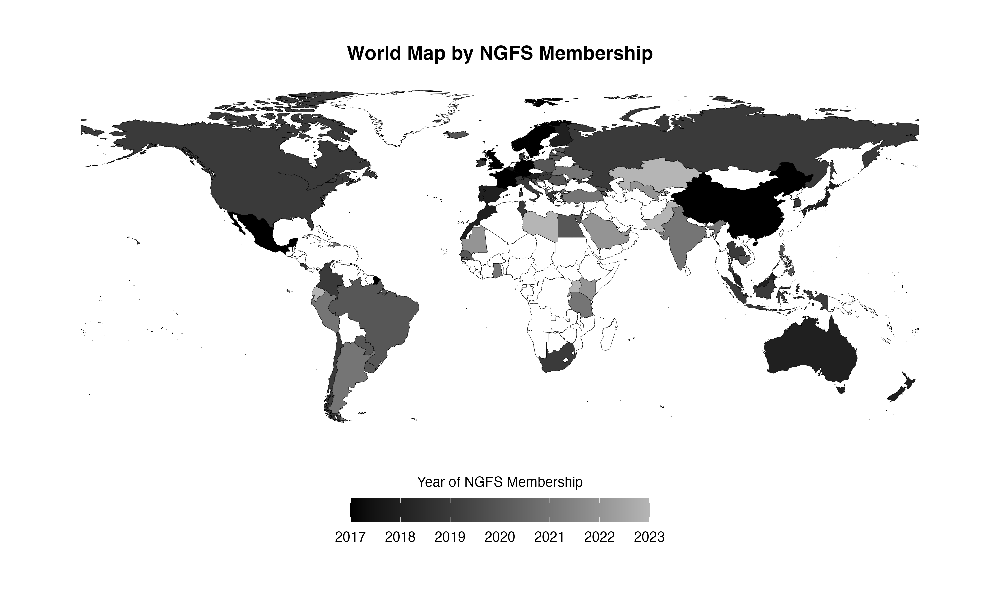
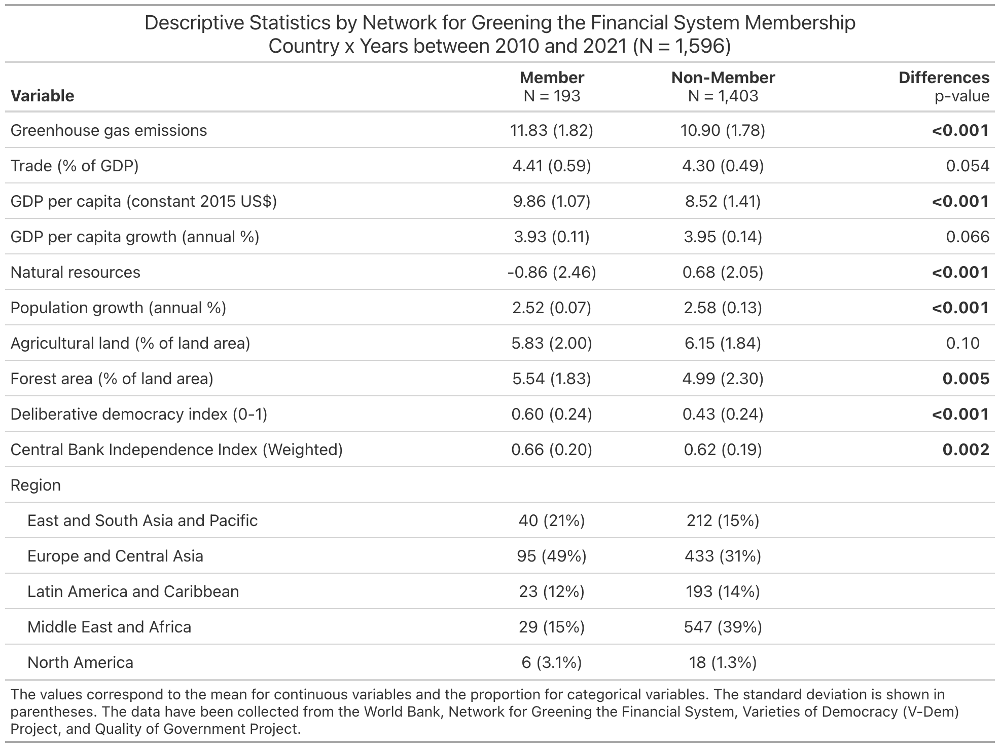
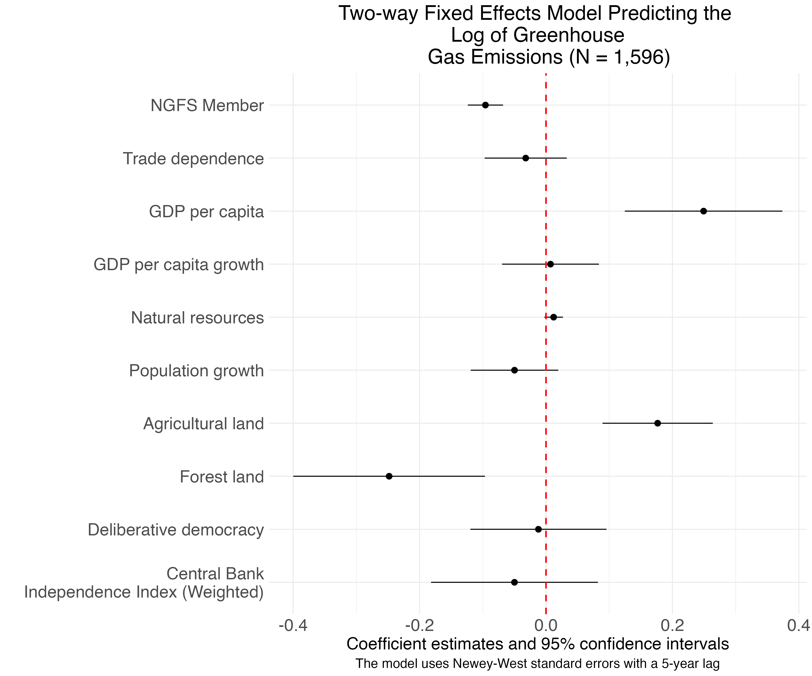
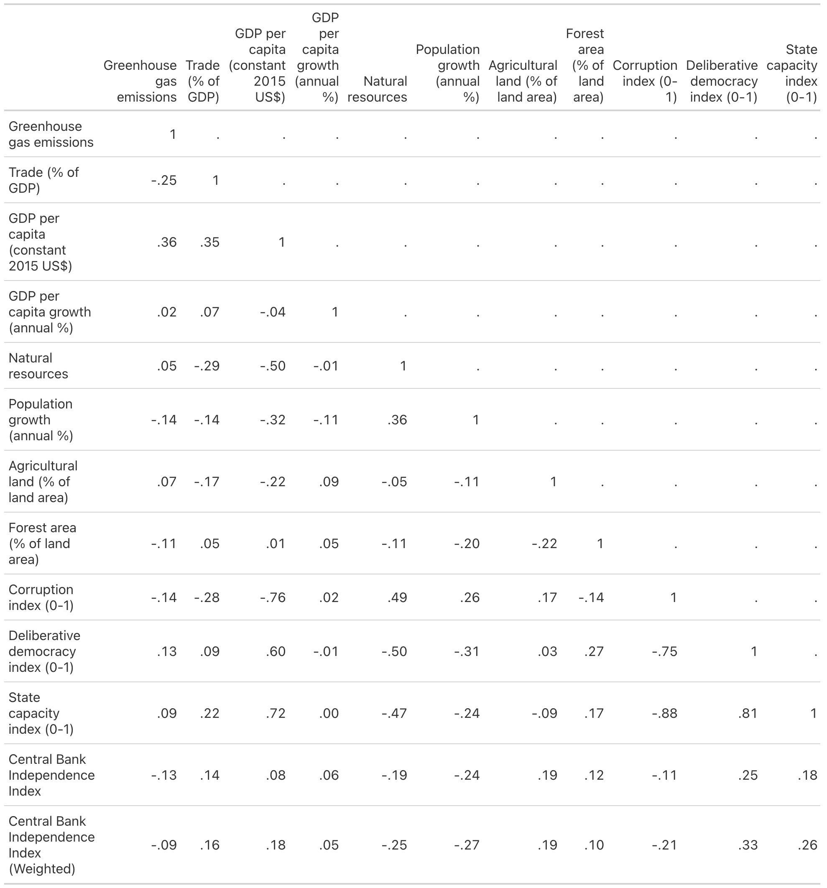

## Central banks and the economy

-   Central banks have historically worked to stabilize the economy and direct investments to the productive sector [@evans1995; @wade1990; @zysman1983]

-   This includes when central banks shape industrial policy [@amsden2001; @mazzucato2021; @mazzucato2024; @rodrik2008]

::: notes
Thank you very much for being here and for the chance to present this truly work-in-progress. This is the second time I am presenting these findings, and I would appreciate your feedback on how best to improve things from here.

So, why study central banks in a changing climate? Historically, central banks have worked with both monetary and industrial policy. That is, they have worked to stabilize the economy and direct investments to the productive sector, shaping industrial policy and how supply chains operate.
:::

## Central banks and the environment

-   Today, central banks are key in shaping both economic and environmental policy-making as countries pursue their net-zero goals [@battiston2021; @keenan2019; @meckling2021]

-   Mixed evidence regarding the pursuit of either "brown growth" or "green growth" [@ding2022; @kim2015; @rea2023; @sabel2024]

::: notes

Today, as nations pursue their so-called net-zero goals, central banks are central to both economic and environmental policy-making. However, the evidence for financial activism in helping the state pursue their economic and environmental goals is mixed: Some people talk about the performative state continuing to invest in brown growth, while others do talk about a new environmental developmental state pursuing green growth.

:::

## Central banks, the economy, and the environment

-   Institutions and organizations are embedded in a changing climate [@dias2023; @sterett2025]

-   Institutional efforts still needed to recouple the economy and the environment [@jorgenson2012], or re-embed the environment into the economy [@polanyi2001]

-   To recouple the economy and the environment, central banks are expected to play a key role in decarbonizing the global economy [@helleiner2025]

::: notes

Regardless of these differences, both institutions and organizations are embedded in a changing climate, which influences institutional and economic performance. And, it is still well-documented that efforts to recouple the economy and the environment are needed. To do that, central banks are key players in governing economic relations between and within countries while directing the global economy towards decarbonization.

:::

## Question

-   But do "green" central banks help reduce GHGs? In fact, how can we measure "green" central banks?

::: notes

This raises an empirical question: Do green central banks help reduce greenhouse gas emissions?

:::

```{r}
#| label: Loading packages and data
#| eval: false
#| include: false

rm(list = ls())

library(readxl)
library(writexl)
library(tidyverse)
library(gt)
library(magrittr)
library(vdemdata)
library(wbstats)
library(describedata)
library(modelsummary)
library(kableExtra)
library(survival)
library(survminer)
library(plm)
library(lmtest)
library(sandwich)
library(gtsummary)
library(car)
library(rnaturalearth)
library(sf)
library(fixest)
library(marginaleffects)
library(did)

gcb_data <- readRDS("gcb_data.rds")

```

```{r}
#| label: Map
#| eval: false
#| include: false

world <- ne_countries(scale = "medium", returnclass = "sf") |>
  filter(continent != "Antarctica")

ngfs_members <- data.frame(
  gu_a3 = c("ALB", "ARG", "ARM", "AUS", "AUT", "BEL", "BRA", 
            "KHM", "CAN", "CHL", "CHN", "COL", "CRI", "HRV", 
            "CYP", "DNK", "EGY", "EST", "FIN", "FRA", "GEO", 
            "DEU", "GHA", "GRC", "GGY", "HKG", "HUN", "ISL", 
            "IND", "IDN", "IRL", "IMN", "ISR", "ITA", "JPN", 
            "JEY", "JOR", "LVA", "LTU", "LUX", "MYS", "MLT", 
            "MUS", "MEX", "MCO", "MAR", "NZL", "NOR", "PRY", 
            "PER", "PHL", "POL", "PRT", "DOM", "ROU", "RUS", 
            "SEN", "SRB", "SYC", "SGP", "SVK", "SVN", "ZAF", 
            "KOR", "ESP", "SWE", "CHE", "TZA", "THA", "TTO", 
            "TUN", "TUR", "UKR", "GBR", "USA", "URY"),
  member = "NGFS Member")

world <- world |>
  left_join(ngfs_members, by = c("gu_a3" = "gu_a3")) |>
  mutate(member = ifelse(is.na(member), "Non-member", member)
  )

ngfs_map <- ggplot(data = world) +
  geom_sf(aes(fill = member), color = "black", size = 0.1) +
  scale_fill_manual(
    values = c("NGFS Member" = "darkgrey", 
               "Non-member" = "white")) +
  theme_minimal() +
  theme(
    panel.grid = element_blank(),  
    legend.position = "bottom",
    axis.text = element_blank(),
    plot.title = element_text(hjust = 0.5)     
  ) +
  labs(
    title = "World Map by Network for Greening the Financial 
    System (NGFS) Membership",
    fill = "Membership Status"
  )

ggsave(
    plot = ngfs_map,
    filename = "ngfs_map.png",
    bg = "white",
    dpi = 300
    )

```

## Novel dataset

{fig-align="center" width="500"}

Prepared by Vitor M. Dias

::: notes
To the best of my knowledge, that question is still open for empirical assessment. It was when scholars started paying attention to central banks members of the Network for Greening the Financial System (NGFS), an international network created by the French central bank and its counterparts in nations ranging from Mexico do China. Here, I will count NGFS members as "green central" banks. To do so, I put together this novel dataset of NGFS members, which shows here some imbalance in the distribution of county members up until when the data of membership was shared with me last year. Basically, African nations and other global south countries still need to be better represented.
:::

## Data

-   Data shared by the NGFS in March 2024
-   Central bank's country of origin $+$ year of membership
-   Balanced panel data: All countries appear over the same period of time
-   133 countries between 2010-2021 (12 years), i.e., $133 \times 12$
    -   $N = 1,596$

::: notes
The NGFS representatives kindly shared their data of membership by year, which allowed me to construct a country x year dataset accounting for when a central bank from a certain nation joined the NGFS. Based on having observations to create a balanced panel data of 136 countries spanning 2010 to 2021, I was able to build a global dataset of 2,856 country x years.
:::

## Independent variable

::::: columns
::: {.column width="50%"}
-   Independent variable: NGFS member v. non-member
-   The French central bank joined the NGFS in 2017
-   France is coded as 1 from 2017 onward, after receiving "the treatment." Coded as 0 otherwise
:::

::: {.column width="50%"}
{fig-align="center" width="296"}
:::
:::::

::: notes
When a central bank from a certain nation joined the NGFS is my independent variable, indicating NGFS members v. non-members in the year in which the membership happened. For example, France, which co-founded the NGFS, is coded as 1 from 2017 onward and 0 otherwise – if I may borrow this language, after receiving the treatment. Countries who never became members are coded as 0.
:::

## Dependent and control variables

-   Dependent variable: Log of greenhouse gas emissions
    -   Collected from the [Emissions Database for Global Atmospheric Research (EDGAR)](https://edgar.jrc.ec.europa.eu/)
    -   Consistent harmonized data by country and sector
-   Control variables have been collected from the World Bank, Varieties of Democracy (V-DEM), and Quality of Government datasets
    -   Economic, environmental, and political covariates
    -   Missing data for controls restricted the dataset to 2021

::: notes
NGFS membership being the independent variable, the main dependent variable is the log of greenhouse gas emissions. I will be happy to talk about the emissions data in the Q&A. And other economic, environmental, and political controls come from the World Bank and the Varieties of Democracy. Because this is an initial assessment, I have decided to take the most conservative approach as possible to create again a balanced panel data with missing data making me restrict the dataset up to 2021 instead of using imputation and the like.
:::

```{r}
#| label: Descriptive Statistics
#| eval: false
#| include: false

descriptives <- gcb_data

# Country (n=136) and year (n=21)

descriptives |>
  group_by(year) |>
  summarise(n = n()) |>
  print(n = 25)

# Renaming and labeling the data for descriptive statistics purposes
descriptives <- descriptives |>
  mutate(ngfs_member = ifelse(ngfs_member == 1, "Member", "Non-Member")) |>
  select(ngfs_member,
         "Greenhouse gas emissions" = "log_ed_ghg_emissions",
         "Trade dependence" = "log_trade",
         "GDP per capita" = "log_gdp_pc",
         "GDP per capita growth" = "log_gdp_pc_growth_shifted",
         "Natural resources" = "log_tot_nat_resources_shifted",
         "Population growth" = "log_pop_growth_shifted",
#         "Population density" = "log_pop_density",
         "Agricultural land" = "sqrt_agric_area",
         "Forest land" = "sqrt_forest_area",
#         "Corruption index (0-1)" = "vdem_corruption",
         "Deliberative democracy index (0-1)" = "vdem_delibdem",
         # "Rule of law index" = "vdem_rulelaw", unreliable measure better captured by V-Dem's Rigorous and impartial public administration variable due to the autonomy of central banks, i.e., state capacity
#         "State capacity index (0-1)" = "vdem_statecapacity_scaled",
         "Region" = "cat_region")

```

## Descriptive statistics

```{r}
#| label: Descriptive table
#| eval: false
#| include: false

descriptives$ngfs_member <- as.factor(descriptives$ngfs_member)

desc_table <- descriptives |>
  tbl_summary(
    by = ngfs_member,
    statistic = list(
      all_continuous() ~ "{mean} ({sd})",
      all_categorical() ~ "{n} ({p}%)")
  ) |>
  add_p() |>
  bold_p() |>
  modify_footnote(everything() ~ NA) |>
  modify_header(label = "**Variable**") |>
  as_gt() |>
    tab_header(title = md("Descriptive Statistics by Network for Greening the Financial System Membership <br> Country x Years between 2001 and 2021 (N = 2,856)")
    ) |>
    tab_source_note(
      source_note = md("The values correspond to the mean for continuous 
      variables and the proportion for categorical variables. The standard 
      deviation is shown in parentheses. The data have been collected from the 
      World Bank, the Network for Greening the Financial System, and the 
      Varieties of Democracy (V-Dem) Project.")
    ) |>
#    text_case_match(
#    "Population density (people per sq. km of land area)" ~ "Population density"
#    ) |>
    cols_label(
    p.value = md("**Differences** <br> p-value")
    ) |>
    cols_align_decimal(
      columns = everything(), 
      dec_mark = ".", 
      locale = NULL
    ) |>
#    tab_options(
#    table.width = pct(90),  # Adjusts table width to 90% of slide width
#    column_labels.font.size = px(16),  # Adjust column label font size
#    table.font.size = px(14)  # Adjusts overall table text size
#    ) |>
  gtsave("desc_table.png")


```

{fig-align="center"}

::: notes
And here are some descriptive statistics about the data by membership. I will be happy to talk about the variables in the Q&A. For now, we see some preliminary significant differences between groups here. Members emit more GHGs than non-members, and they tend to be richer - mainly industrialized nations, in summary.
:::

## Two-Way Fixed Effects DID

```{r}
#| label: Panel data models
#| eval: false
#| include: false

pfmt_data <- pdata.frame(gcb_data, 
                        index = c("country",
                                  "year")
                        )

# Two-way fixed effects based on Chesler et al. 2023

twowaym1 <- plm(log_ed_ghg_emissions ~ factor(ngfs_member) +
                factor(cat_region),
                data = pfmt_data, 
                model = "within",
                index = c("country", "year"),
                effect = "twoway")

twowaym2 <- plm(log_ed_ghg_emissions ~ factor(ngfs_member) +
                factor(cat_region) + 
                log_trade + 
                log_gdp_pc + 
                log_gdp_pc_growth_shifted + 
                log_tot_nat_resources_shifted + 
#                log_pop_density + 
                log_pop_growth_shifted +
                sqrt_agric_area + 
                sqrt_forest_area,
                data = pfmt_data, 
                model = "within",
                index = c("country", "year"),
                effect = "twoway")

twowaym3 <- plm(log_ed_ghg_emissions ~ factor(ngfs_member) +
                factor(cat_region) + 
                log_trade + 
                log_gdp_pc + 
                log_gdp_pc_growth_shifted +
                log_tot_nat_resources_shifted + 
#                log_pop_density + 
                log_pop_growth_shifted +
                sqrt_agric_area + 
                sqrt_forest_area + 
                vdem_corruption + 
                vdem_statecapacity_scaled +
                vdem_delibdem,
                data = pfmt_data, 
                model = "within",
                index = c("country", "year"),
                effect = "twoway")

twowaymodels <- list(
    "Model 1" = twowaym1,
    "Model 2" = twowaym2,
    "Model 3" = twowaym3)

# Driscoll-Kraay standard errors with a 5-year lag for each model

dk_se_list <- list(
    "Model 1" = vcovSCC(twowaym1, type = "HC0", max.lag = 5),
    "Model 2" = vcovSCC(twowaym2, type = "HC0", max.lag = 5),
    "Model 3" = vcovSCC(twowaym3, type = "HC0", max.lag = 5)
)

coef_map1 <- c("factor(ngfs_member)1" = "NGFS Member",
              "factor(cat_region)East + South Asia and Pacific" = "East + South Asia and Pacific",
              "factor(cat_region)Latin America and Caribbean" = "Latin America and Caribbean",
              "factor(cat_region)Middle East and Africa" = "Middle East and Africa",
              "factor(cat_region)North America" = "North America",
              "log_trade" = "Trade dependence",
              "log_gdp_pc" = "GDP per capita",
              "log_gdp_pc_growth_shifted" = "GDP per capita growth",
              "log_tot_nat_resources_shifted" = "Natural resources",
#              "log_pop_density" = "Population density",
              "log_pop_growth_shifted" = "Population growth",
              "sqrt_agric_area" = "Agricultural land",
              "sqrt_forest_area" = "Forest land",
#              "vdem_corruption" = "Corruption index",
              "vdem_statecapacity_scaled" = "State capacity",
              "vdem_delibdem" = "Deliberative democracy"
              )

twoway_table <- modelsummary(twowaymodels,
             stars = TRUE,
             fmt = 2,
             gof_map = c("nobs", "adj.r.squared", "bic"),
             coef_map = coef_map1,
             vcov = dk_se_list,
             output = "gt"
            ) |>
             tab_header(
              title = md("Two-Way Fixed Effects Models Predicting the Log of Greenhouse Gas Emissions (N = 2,856)")
            ) |>
            tab_source_note(
              source_note = md("The data have been collected from the World Bank, the Network for Greening the Financial System, and the Varieties of Democracy (V-Dem) Project. NGFS non-member and Europe are the reference groups for the NGFS and region variables, respectively.")
            ) |>
            gtsave("twoway_table.png")

vcov_model3 <- vcovSCC(twowaym3, type = "HC0", max.lag = 5)

coefplot <- modelplot(
  coef_map = rev(coef_map1),
  vcov = vcov_model3,
  twowaym3) +
  theme_minimal() +
  theme(
    text = element_text(size = 18),        # Increases the overall text size
    axis.text = element_text(size = 18),  # Increases axis text font size
    legend.text = element_text(size = 16),
    plot.title = element_text(hjust = 0.5),
    plot.caption = element_text(hjust = 0.5, size = 14)
  ) +
  geom_vline(
    xintercept = 0,
    color = "red",
    linetype = "dashed",
    linewidth = 0.80
  ) +
  labs(
    title = "Two-way Fixed Effects Model Predicting the Log of Greenhouse 
    Gas Emissions (N = 2,856)",
    caption = str_wrap("The model uses Driscoll-Kraay standard errors with a 5-year lag")
  )

ggsave(
  filename = "coefplot.png", # File name
  plot = coefplot,            # The plot object to save
  width = 12,                 # Width of the image in inches
  height = 10,                # Height of the image in inches
  dpi = 300,                  # Resolution in dots per inch
  bg = "white"
)

```

{fig-align="center"}

::: notes
Now, let's get to some results here. I estimated two-way fixed effects models, and they indeed revealed a significant, negative relationship between NGFS membership and emissions. That is, joining the network has a significant effect on reducing emissions, controlling for these other economic, political, and environmental factors. The controls behave in the expected direction, with GDP PC being the most significant predictor of emissions. Population growth negatively affects emissions, debunking one more time the tragedy of the commons and overpopulation kind of argument. Deliberative democracy is not that strong predictor of emissions, confirming other existing literature.
:::

## Results

-   Main finding: Joining the NGFS significantly reduces GHGs -- about 10% less than non-members

-   Controls behave in the expected direction

    -   GDP per capita significantly increases GHGs, whereas population growth significantly decreases GHGs

-   While the model is statistically causal, I theoretically read the results as an indicator that the NGFS's institutional arrangements seem to be moving in a sustainable direction

::: notes
In sum, joining the NGFS, again, has a significant effect on reducing emissions, with the coefficient suggesting a 10% decrease in emissions compared to non-members. I will not spend too much time on the controls, as they behave in the expected direction – can talk during the Q&A. And the takeaway is that, even though the model is statistically causal, it seems complicated to state firmly that countries that join the NGFS will automatically and causally reduce their emissions. I read the results more from a theoretical lens indicating that the NGFS is promoting best practices that seem to be moving in a sustainable direction.
:::

## Practical discussion: Basel and NGFS

-   Follows Basel principles
-   NGFS is based on voluntary membership
-   Through soft-law institutional design, the NGFS aims to:
    -   Standardize "brown" and "green" investments
    -   Estimate nature-related risks from a financial perspective
    -   Build capacity among members
    -   Design transition plans from carbon-intensive ventures towards more sustainability-oriented investments

::: notes
And if you missed what the NGFS actually does from the presentation, that was intentional. To conclude, why does it seem to be moving in a sustainable path? The NGFS is based on voluntary membership. While Basel takes care of regulating monetary policy and economic stability at the global level, the NGFS follows Basel while trying to have better estimates of what counts as nature-related risks and how they are calculated, how financial firms can maximize their investments in green ventures rather than carbon-intensive ones by having some kind of a more standardized economic measure of that that means. There are also capacity building efforts among NGFS members. And the NGFS proposes some transition plans for the global economy and financial and productive sectors to shift from carbon-intensive investments towards sustainability-oriented ones.
:::

## Literature discussion

-   A case of institutional design for common goods governance [@ostrom1990; @ostrom2005]
-   Stakeholders deliberate on collective mechanisms of financial and industrial policy that align economic and environmental factors
-   Soft law (and power), combined with hard law, matters to greening financial systems and the economy

::: notes
This is a case of institutional design along the lens of Elinor Ostrom's work, whereby these stakeholders find ways to deliberate on collective mechanisms of financial and industrial policy while compromising and discussing how to align economic and environmental factors as the climate crisis continues to be one of the main factors that investment firms see as exacerbating financial risks today. Soft law matters!
:::

## Robustness checks

-   NGFS coefficient maintains the same direction using either country-level fixed effects or random effects

-   Similar model behavior if other, though not so precise, controls are included, e.g., corruption index, state capacity, and population density

-   Selection: Survival, Cox models reveal that GHG emissions and GDP PC significantly [*increase*]{.underline} rather than decrease the probability of joining the NGFS

::: notes
Finally, and briefly, the models behave similarly if I use other model specifications and add other controls that are not so precise. While selection bias might be an issue, survival models indicate that it is not countries that emit less that are more likely to join the NGFS. So, now it is time to proceed with additional analysis, including instrumental variables, and other techniques.
:::

## Next steps

-   Next steps include trying to find the main mechanisms behind the reduction of emissions among NGFS members

-   Qualitative evidence from Brazil's Central Bank vis-à-vis the US FED suggest that institutional capacity and bureaucratic autonomy are important in both economic and environmental policy-making

-   However, the models have not been able to capture such mechanisms well yet

##  {.center}

```{=html}
<div style="text-align: center; font-size: 70px;">
  <p>Thank You!</p>
  <a href="mailto:vmartinsdias@butler.edu">vmartinsdias@butler.edu</a>
</div>
```

::: notes
Thank you very much!
:::

## Correlation Matrix

```{r}
#| label: Correlation matrix
#| eval: false
#| include: false

cormat <- datasummary_correlation(
  descriptives,
  output = "gt"
  ) |>
  gtsave("cormat.png")
```

{fig-align="center"}

```{r}
#| label: Collinearity check
#| eval: false
#| include: false

pooled_twowaym3 <- plm(log_ed_ghg_emissions ~ factor(ngfs_member) +
                factor(cat_region) + 
                log_trade + 
                log_gdp_pc + 
                log_gdp_pc_growth_shifted +
                log_tot_nat_resources_shifted + 
                log_pop_density + 
                log_pop_growth_shifted +
                sqrt_agric_area + 
                sqrt_forest_area + 
                vdem_corruption + 
                vdem_statecapacity_scaled +
                vdem_delibdem,
                data = pfmt_data, 
                model = "pooling",
                index = c("country", "year"),
                effect = "twoway")

vif(pooled_twowaym3)

```

## References

::: {#refs}
:::

```{=html}
<!-- 


## MPSA Feedback

Curious about the mechanisms through which membership reduces GHGs. Cheap talk to join. Is this a learning process?
-   Yes, capacity building, bureaucratic autonomy, and institutional capacity.
-   Are we witnessing a true reduction of GHGs or shifting more pulluting business away?

Question for Noam: Related to Karl's question about legal versus illegal deforestation, how do you account for domestic monitoring systems?

Question for Ha, Serena, and Olivia: Learning from mimetic forces normative forces or something else when it comes to institutional isomorphism? Maybe draw some variables from the Varieties of Democracy dataset?


ASA Feedback

Unpack the mechanisms behind the decrease in GHG emissions among NGFS members.

NSS Feedback

The FED in the US does not seem a "green bank" as having a limited role in helping manage risk in the climate crisis. Is there a distinction between countries based on how their central banks behave towards green or not?

Debate among central banks regarding managing climate risks.

The ability of a central bank to enforce policies. 

-->
```